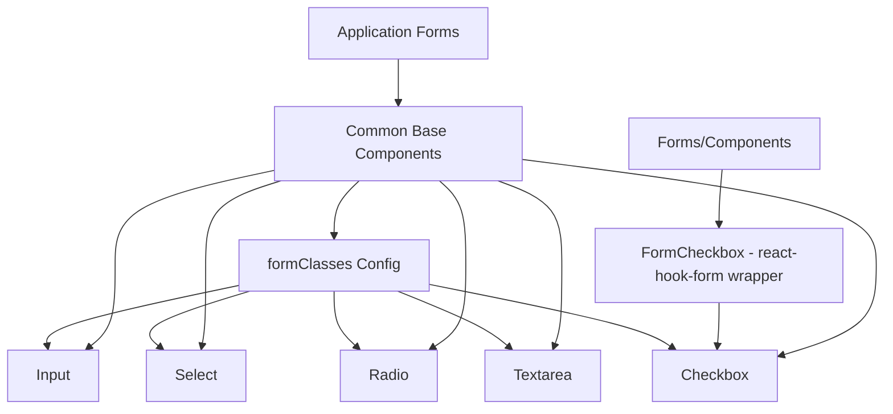

# System Design & Architecture

## Architecture Overview

**What is the high-level system structure?**



**Key components and their responsibilities:**

- **Common base components**: Reusable, framework-agnostic form inputs
- **formClasses configuration**: Centralized styling configuration
- **Forms/Components**: Higher-level form components that integrate with react-hook-form
- **Base components** provide the foundation that can be wrapped by form-specific components

**Technology stack:**

- React 18+ with TypeScript
- Tailwind CSS for styling
- class-variance-authority (cva) for component variants (optional, follow Button pattern)
- forwardRef for ref forwarding

## Data Models

**Component Props Interfaces:**

### Input

```typescript
interface InputProps extends InputHTMLAttributes<HTMLInputElement> {
    label?: string;
    helperText?: string;
    error?: string;
    wrapperClassName?: string;
}
```

### Select

```typescript
interface SelectProps extends SelectHTMLAttributes<HTMLSelectElement> {
    label?: string;
    helperText?: string;
    error?: string;
    options: Array<{ value: string; label: string }>;
    wrapperClassName?: string;
}
```

### Radio

```typescript
interface RadioProps extends InputHTMLAttributes<HTMLInputElement> {
    label: string;
    helperText?: string;
    error?: string;
    wrapperClassName?: string;
}
```

### Checkbox

```typescript
interface CheckboxProps extends InputHTMLAttributes<HTMLInputElement> {
    label: string;
    helperText?: string;
    error?: string;
    wrapperClassName?: string;
}
```

### Textarea

```typescript
interface TextareaProps extends TextareaHTMLAttributes<HTMLTextAreaElement> {
    label?: string;
    helperText?: string;
    error?: string;
    autoResize?: boolean;
    wrapperClassName?: string;
}
```

## Component Breakdown

### 1. Input Component

**File**: `packages/core/ui/src/common/Input.tsx`

**Features:**

- Standard text input with label, helper text, and error states
- Support for all native input types (text, email, password, number, etc.)
- Disabled state with appropriate styling
- Dark mode support
- forwardRef for integration with form libraries

### 2. Select Component

**File**: `packages/core/ui/src/common/Select.tsx`

**Features:**

- Single and multiple selection support (via `multiple` prop)
- Options passed as array of {value, label} objects
- Label, helper text, and error states
- Disabled state styling
- Dark mode support
- forwardRef support

### 3. Radio Component

**File**: `packages/core/ui/src/common/Radio.tsx`

**Features:**

- Radio button with label
- Error and helper text support
- Disabled state
- Dark mode support
- forwardRef support
- Works with radio groups (same name attribute)

### 4. Checkbox Component

**File**: `packages/core/ui/src/common/Checkbox.tsx`

**Features:**

- Basic checkbox without react-hook-form dependency
- Label, helper text, and error states
- Disabled state styling
- Dark mode support
- forwardRef support
- Foundation for FormCheckbox wrapper

### 5. Textarea Component

**File**: `packages/core/ui/src/common/Textarea.tsx`

**Features:**

- Multi-line text input
- Optional auto-resize functionality
- Label, helper text, and error states
- Disabled state
- Dark mode support
- forwardRef support

### 6. formClasses Configuration Extension

**File**: `packages/core/ui/src/forms/config.ts`

**Additions:**

```typescript
export const formClasses = {
    // Existing
    checkbox: "...",
    helperText: "...",
    error: "...",

    // New additions
    input: "...",
    select: "...",
    radio: "...",
    textarea: "...",
    label: "..."
};
```

## Design Decisions

**Why did we choose this approach?**

1. **Base components in common folder**
    - Makes components reusable across all packages
    - Separates base UI from form-specific logic
    - Follows the pattern established by Button, Card, Badge

2. **Native HTML elements over custom dropdowns**
    - Better accessibility out of the box
    - Simpler implementation and maintenance
    - Smaller bundle size
    - Can upgrade to custom dropdowns later if needed

3. **Consistent API across all components**
    - All components accept label, helperText, error, wrapperClassName
    - All use forwardRef for form library integration
    - All follow same styling pattern with formClasses

4. **Separate Checkbox from FormCheckbox**
    - Base Checkbox is framework-agnostic
    - FormCheckbox can wrap Checkbox with react-hook-form integration
    - Allows using base Checkbox without form library dependency

5. **Extend formClasses instead of inline styles**
    - Centralized styling configuration
    - Easy to maintain consistent theme
    - Can be overridden via className prop

## API Design

**Component Usage Examples:**

```tsx
// Input
<Input
  label="Email"
  type="email"
  placeholder="Enter your email"
  helperText="We'll never share your email"
  error={errors.email}
/>

// Select - Single
<Select
  label="Country"
  options={[
    { value: 'us', label: 'United States' },
    { value: 'uk', label: 'United Kingdom' }
  ]}
  error={errors.country}
/>

// Select - Multiple
<Select
  label="Interests"
  multiple
  options={[
    { value: 'tech', label: 'Technology' },
    { value: 'sports', label: 'Sports' }
  ]}
/>

// Radio
<Radio
  name="plan"
  value="basic"
  label="Basic Plan"
  helperText="$10/month"
/>

// Checkbox
<Checkbox
  label="Accept terms and conditions"
  error={errors.terms}
/>

// Textarea
<Textarea
  label="Description"
  autoResize
  placeholder="Enter description..."
  rows={4}
/>
```

## Non-Functional Requirements

**Performance:**

- Minimal re-renders (use React.memo if needed)
- No unnecessary state or effects
- Lazy load auto-resize logic for Textarea

**Accessibility:**

- Proper label associations (htmlFor/id)
- ARIA attributes for error states (aria-invalid, aria-describedby)
- Keyboard navigation support
- Screen reader friendly

**Scalability:**

- Components are stateless and composable
- Can be extended with additional variants using CVA
- Can be wrapped by form-specific components

**Security:**

- No XSS vulnerabilities (React handles escaping)
- Proper input validation left to form libraries
- No eval or dangerouslySetInnerHTML
