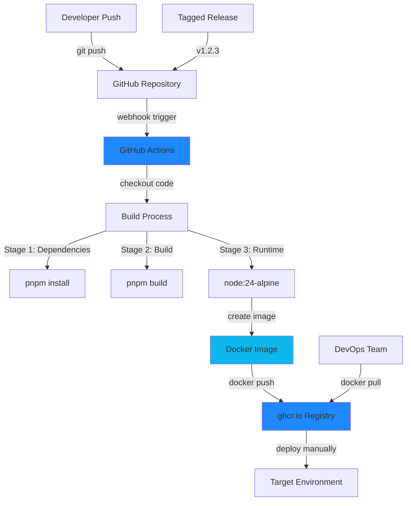

# System Design & Architecture

## Architecture Overview

**What is the high-level system structure?**



**Key components and their responsibilities:**

1. **Dockerfile (Multi-stage)**
    - Stage 1 (Builder): Install dependencies with pnpm
    - Stage 2 (Builder): Build host-root application
    - Stage 3 (Runtime): Copy built assets to minimal runtime image
    - Optimize for size and security

2. **GitHub Actions Workflow**
    - Trigger on push to main and tagged releases (v\*)
    - Validate Dockerfile on PRs (no push)
    - Build Docker image with caching
    - Tag with semantic version and latest
    - Push to GitHub Container Registry
    - Clean up old images (optional)

3. **GitHub Container Registry (ghcr.io)**
    - Store versioned Docker images
    - Provide image access with GitHub tokens
    - Host images for manual deployment

4. **.dockerignore**
    - Exclude unnecessary files from build context
    - Reduce build context size and speed

**Technology stack choices and rationale:**

- **Base Image:** `node:24-alpine` - Minimal size, matches project Node version
- **Multi-stage Build:** Separate build and runtime stages to minimize final image size
- **pnpm:** Use existing monorepo package manager with workspace support
- **Vite:** Production build with optimizations enabled
- **GitHub Actions:** Native integration with GitHub, free tier sufficient
- **ghcr.io:** Free for public repos, tight GitHub integration, no external dependencies

## Data Models

**What data do we need to manage?**

**Docker Image Metadata:**

```yaml
image: ghcr.io/trongtien/page-builder-cms/host-root
tags:
    - latest # Latest main branch build
    - v1.2.3 # Semantic version tag
    - sha-abc1234 # Git commit SHA (optional)
labels:
    - org.opencontainers.image.source: https://github.com/trongtien/page-builder-cms
    - org.opencontainers.image.version: 1.2.3
    - org.opencontainers.image.created: 2025-12-16T10:30:00Z
    - org.opencontainers.image.revision: abc1234
```

**GitHub Actions Workflow Artifacts:**

- Build logs
- Image digests
- Layer cache keys
- Build duration metrics

**Configuration Data:**

- Environment variables (runtime)
- Build-time arguments
- Registry credentials (GitHub secrets)

## API Design

**How do components communicate?**

**Docker Registry API (ghcr.io):**

```bash
# Authentication
echo $GITHUB_TOKEN | docker login ghcr.io -u USERNAME --password-stdin

# Push image
docker push ghcr.io/trongtien/page-builder-cms/host-root:latest

# Pull image
docker pull ghcr.io/trongtien/page-builder-cms/host-root:v1.2.3

# List tags
curl -H "Authorization: Bearer $GITHUB_TOKEN" \
  https://ghcr.io/v2/trongtien/page-builder-cms/host-root/tags/list
```

**GitHub Actions Workflow Triggers:**

```yaml
on:
    push:
        branches: [main]
        tags: ["v*"]
    pull_request:
        branches: [main]
```

**Container Runtime Interface:**

```bash
# Run container with environment variables
docker run -p 3000:3000 \
  -e NODE_ENV=production \
  -e API_URL=https://api.example.com \
  ghcr.io/trongtien/page-builder-cms/host-root:latest
```

## Component Breakdown

**What are the major building blocks?**

### 1. Dockerfile

**Location:** `packages/host-root/Dockerfile`

**Structure:**

```dockerfile
# Stage 1: Base & Dependencies
FROM node:24-alpine AS base
# Install pnpm, setup workspace

# Stage 2: Builder
FROM base AS builder
# Copy workspace files
# Install dependencies (pnpm install --frozen-lockfile)
# Build host-root (pnpm --filter @page-builder/host-root build)

# Stage 3: Runtime
FROM node:24-alpine AS runtime
# Copy only production build
# Setup minimal runtime environment
# Expose port 3000
# CMD to start application
```

**Key decisions:**

- Three-stage build: base, builder, runtime
- Alpine Linux for minimal size
- Only copy build output, not source code
- Use pnpm with workspace filtering

### 2. .dockerignore

**Location:** `packages/host-root/.dockerignore`

**Excludes:**

- node_modules (installed in container)
- dist (built in container)
- .git, .github
- Development files (\*.md, .env.local)
- Test files

### 3. GitHub Actions Workflow

**Location:** `.github/workflows/docker-build.yml`

**Jobs:**

1. **validate-docker** (on PRs)
    - Checkout code
    - Build Dockerfile without pushing
    - Verify build succeeds

2. **build-and-push** (on main/tags)
    - Checkout code
    - Setup Docker Buildx
    - Login to ghcr.io
    - Extract metadata (tags, labels)
    - Build with cache
    - Push to registry

**Caching Strategy:**

- Use GitHub Actions cache for Docker layers
- Cache pnpm store
- Reuse layers between builds

### 4. Container Runtime Configuration

**Entrypoint:** Node.js server running Vite preview or custom server

**Port:** 3000 (default Vite preview port)

**Health Check:**

```dockerfile
HEALTHCHECK --interval=30s --timeout=3s --start-period=5s --retries=3 \
  CMD node -e "require('http').get('http://localhost:3000/health', (r) => process.exit(r.statusCode === 200 ? 0 : 1))"
```

## Design Decisions

**Why did we choose this approach?**

### Decision 1: Multi-stage Docker Build

**Choice:** Three-stage build (base → builder → runtime)

**Rationale:**

- Minimize final image size (exclude build tools and source code)
- Security: Runtime image contains only necessary files
- Separate build dependencies from runtime dependencies
- Industry best practice for production containers

**Alternatives considered:**

- Single-stage build: Simpler but larger image size (~800MB vs ~150MB)
- Two-stage build: Could work but less flexible

**Trade-offs:**

- More complex Dockerfile
- Longer initial build time
- Significantly smaller final image and better security

### Decision 2: GitHub Container Registry (ghcr.io)

**Choice:** Use ghcr.io instead of Docker Hub

**Rationale:**

- Native GitHub integration (same authentication)
- Free for public repositories
- Better permissions management with GitHub teams
- Automatic linking to repository
- No need for external service setup

**Alternatives considered:**

- Docker Hub: Requires separate account, rate limiting on free tier
- AWS ECR: Overkill for manual deployment, requires AWS setup
- Self-hosted registry: Too much maintenance overhead

**Trade-offs:**

- Locked into GitHub ecosystem
- Sufficient for current needs

### Decision 3: pnpm Workspace Filtering

**Choice:** Use `pnpm --filter @page-builder/host-root build` in Docker

**Rationale:**

- Only build host-root and its dependencies
- Respects monorepo workspace structure
- Leverages existing build configuration
- Faster builds by skipping unrelated packages

**Alternatives considered:**

- Build entire monorepo: Wastes time building unused packages
- Copy only host-root: Breaks workspace dependencies

**Trade-offs:**

- Requires understanding of pnpm workspace syntax
- More complex than simple npm build

### Decision 4: Semantic Versioning Tags

**Choice:** Tag images with git tags (v1.2.3) and latest

**Rationale:**

- Clear version tracking
- Enables rollback to specific versions
- Standard industry practice
- Latest tag for convenience

**Alternatives considered:**

- Only git SHA tags: Less human-readable
- Date-based tags: Harder to understand version lineage
- No versioning: Can't track or rollback

**Trade-offs:**

- Requires discipline in tagging releases
- Multiple tags per image (storage overhead minimal)

### Decision 5: Build on Push to Main

**Choice:** Build and push on every main branch commit

**Rationale:**

- Always have latest main available as Docker image
- Fast feedback on container build issues
- Enables quick manual deployments from main

**Alternatives considered:**

- Only build on tags: Delays availability of latest changes
- Build on schedule: Wastes resources, doesn't match code changes

**Trade-offs:**

- Uses GitHub Actions minutes on every main push
- Acceptable given free tier limits and project size

## Non-Functional Requirements

**How should the system perform?**

### Performance Targets

**Build Time:**

- First build: < 10 minutes
- Cached build: < 3 minutes
- CI/CD total: < 12 minutes

**Image Size:**

- Target: < 200MB
- Maximum acceptable: 300MB
- Baseline (single-stage): ~800MB

**Runtime Performance:**

- Container start time: < 5 seconds
- Application ready: < 10 seconds
- No performance degradation vs non-containerized

### Scalability Considerations

- Horizontal scaling: Multiple containers can run simultaneously
- Stateless application: No shared state between container instances
- Cache layer reuse: Faster builds as project grows
- Registry storage: Within GitHub free tier limits (500MB → ~2-3 versions)

### Security Requirements

**Container Security:**

- Use official Node.js Alpine base image (regularly updated)
- Minimal attack surface (no unnecessary packages)
- Non-root user for runtime (if possible)
- No secrets baked into image

**Registry Security:**

- GitHub token authentication required
- Image signing (optional, future enhancement)
- Vulnerability scanning with GitHub Advanced Security (if enabled)

**Secrets Management:**

- GitHub Secrets for registry authentication
- Environment variables for runtime configuration
- No hardcoded credentials in Dockerfile

### Reliability/Availability Needs

**CI/CD Reliability:**

- Retry failed builds (GitHub Actions built-in)
- Cache fallback if cache miss occurs
- Clear error messages for build failures

**Image Availability:**

- ghcr.io uptime: 99.9% (GitHub SLA)
- Multiple tagged versions available for rollback
- Latest tag always points to working build

**Build Consistency:**

- Locked dependencies (pnpm-lock.yaml)
- Reproducible builds with frozen lockfile
- Consistent Node.js version across environments
