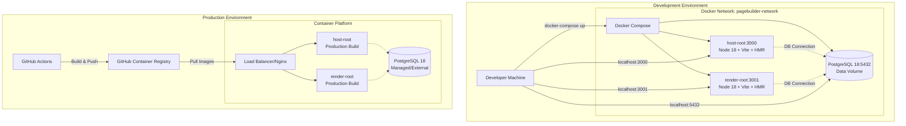

# System Design & Architecture: Docker Containerization

## Architecture Overview

**What is the high-level system structure?**



### Key Components

1. **Docker Compose (Development)**
    - Orchestrates multi-container local development
    - Manages service dependencies and startup order
    - Handles networking and volume mounting

2. **Frontend Containers (host-root, render-root)**
    - **Dev**: Node 18 base image with pnpm, Vite dev server, hot-reload
    - **Prod**: Multi-stage build (build → nginx static serve)
    - Exposed ports: 3000 (host-root), 3001 (render-root)

3. **Database Container (PostgreSQL 18)**
    - Official PostgreSQL 18 Alpine image
    - Data persistence via Docker volumes
    - Initialization scripts for schema setup
    - Exposed port: 5432

4. **Shared Resources**
    - Docker network for inter-container communication
    - Named volumes for data persistence
    - Bind mounts for source code (dev only)

### Technology Stack

| Component           | Development        | Production                                      |
| ------------------- | ------------------ | ----------------------------------------------- |
| **Base Images**     | node:18-alpine     | node:18-alpine (build)<br/>nginx:alpine (serve) |
| **Package Manager** | pnpm               | pnpm (build only)                               |
| **Build Tool**      | Vite (dev mode)    | Vite (build) + nginx                            |
| **Database**        | postgres:18-alpine | postgres:18-alpine or managed                   |
| **Orchestration**   | Docker Compose     | K8s/ECS (future)                                |

**Rationale:**

- **Alpine Linux**: Minimal image size (~5MB base vs ~100MB)
- **Multi-stage builds**: Separate build and runtime environments
- **nginx in prod**: Fast static file serving, small footprint
- **pnpm**: Faster installs, better disk usage than npm/yarn

## Container Structure

**What are the Docker configurations?**

### Directory Structure

```
.containers/
├── dev/
│   ├── docker-compose.yml           # Development orchestration
│   ├── frontend/
│   │   └── Dockerfile.dev           # Dev Dockerfile for both frontends
│   └── database/
│       ├── Dockerfile               # PostgreSQL with custom config
│       └── init/
│           └── 01-init-schema.sql   # Initial schema setup
├── prod/
│   ├── docker-compose.yml           # Production orchestration (optional)
│   ├── host-root/
│   │   └── Dockerfile               # Production multi-stage
│   ├── render-root/
│   │   └── Dockerfile               # Production multi-stage
│   └── nginx/
│       └── nginx.conf               # Nginx configuration
└── .dockerignore                    # Ignore patterns
```

### Development Dockerfile (Frontend)

**File**: `.containers/dev/frontend/Dockerfile.dev`

```dockerfile
# Development Dockerfile for Frontend Apps
FROM node:18-alpine

# Install pnpm globally
RUN npm install -g pnpm@latest

# Set working directory
WORKDIR /app

# Copy package files for dependency installation
COPY package.json pnpm-lock.yaml pnpm-workspace.yaml ./
COPY packages/package.json packages/
COPY apps/*/package.json apps/*/

# Install dependencies
RUN pnpm install --frozen-lockfile

# Copy source code (mounted as volume in docker-compose)
# COPY . .

# Expose port for dev server
EXPOSE 3000

# Start development server
CMD ["pnpm", "dev"]
```

**Key Features:**

- Source code mounted as volume for hot-reload
- Dependencies installed during image build
- Vite dev server with HMR enabled
- Fast rebuilds (only dependencies layer changes)

### Production Dockerfile (Frontend)

**File**: `.containers/prod/host-root/Dockerfile`

```dockerfile
# Multi-stage build for Production
# Stage 1: Build
FROM node:18-alpine AS builder

# Install pnpm
RUN npm install -g pnpm@latest

WORKDIR /app

# Copy workspace files
COPY package.json pnpm-lock.yaml pnpm-workspace.yaml ./
COPY turbo.json ./
COPY packages/ ./packages/
COPY apps/host-root/ ./apps/host-root/

# Install dependencies (including dev dependencies for build)
RUN pnpm install --frozen-lockfile

# Build the application
RUN pnpm --filter @page-builder/host-root build

# Stage 2: Production Runtime
FROM nginx:alpine

# Copy built static files from builder
COPY --from=builder /app/apps/host-root/dist /usr/share/nginx/html

# Copy nginx configuration
COPY .containers/prod/nginx/nginx.conf /etc/nginx/nginx.conf

# Expose port
EXPOSE 80

# Health check
HEALTHCHECK --interval=30s --timeout=3s --start-period=5s --retries=3 \
  CMD wget --no-verbose --tries=1 --spider http://localhost/health || exit 1

# Start nginx
CMD ["nginx", "-g", "daemon off;"]
```

**Key Features:**

- Multi-stage build separates build-time and runtime dependencies
- Final image contains only static files + nginx (~20MB)
- Health check endpoint for container orchestration
- No Node.js in final image (security + size benefits)

### Database Dockerfile

**File**: `.containers/dev/database/Dockerfile`

```dockerfile
FROM postgres:18-alpine

# Copy initialization scripts
COPY .containers/dev/database/init/*.sql /docker-entrypoint-initdb.d/

# Set default environment variables (override in docker-compose)
ENV POSTGRES_DB=pagebuilder
ENV POSTGRES_USER=postgres
ENV POSTGRES_PASSWORD=postgres

# Expose PostgreSQL port
EXPOSE 5432

# Health check
HEALTHCHECK --interval=10s --timeout=3s --start-period=10s --retries=3 \
  CMD pg_isready -U postgres || exit 1
```

### Docker Compose (Development)

**File**: `.containers/dev/docker-compose.yml`

```yaml
version: "3.9"

services:
    # PostgreSQL Database
    database:
        build:
            context: ../../
            dockerfile: .containers/dev/database/Dockerfile
        container_name: pagebuilder-db
        environment:
            POSTGRES_DB: pagebuilder
            POSTGRES_USER: postgres
            POSTGRES_PASSWORD: ${DB_PASSWORD:-postgres}
            POSTGRES_HOST_AUTH_METHOD: trust
        volumes:
            - pgdata:/var/lib/postgresql/data
            - ./database/init:/docker-entrypoint-initdb.d
        ports:
            - "5432:5432"
        networks:
            - pagebuilder-network
        healthcheck:
            test: ["CMD-SHELL", "pg_isready -U postgres"]
            interval: 10s
            timeout: 5s
            retries: 5

    # Host Root Frontend
    host-root:
        build:
            context: ../../
            dockerfile: .containers/dev/frontend/Dockerfile.dev
        container_name: pagebuilder-host-root
        working_dir: /app/apps/host-root
        command: pnpm dev --host 0.0.0.0
        environment:
            - NODE_ENV=development
            - DB_HOST=database
            - DB_PORT=5432
            - DB_NAME=pagebuilder
            - DB_USER=postgres
            - DB_PASSWORD=${DB_PASSWORD:-postgres}
        volumes:
            - ../../:/app
            - /app/node_modules
            - /app/apps/host-root/node_modules
        ports:
            - "3000:3000"
        networks:
            - pagebuilder-network
        depends_on:
            database:
                condition: service_healthy
        stdin_open: true
        tty: true

    # Render Root Frontend
    render-root:
        build:
            context: ../../
            dockerfile: .containers/dev/frontend/Dockerfile.dev
        container_name: pagebuilder-render-root
        working_dir: /app/apps/render-root
        command: pnpm dev --host 0.0.0.0
        environment:
            - NODE_ENV=development
            - DB_HOST=database
            - DB_PORT=5432
            - DB_NAME=pagebuilder
            - DB_USER=postgres
            - DB_PASSWORD=${DB_PASSWORD:-postgres}
        volumes:
            - ../../:/app
            - /app/node_modules
            - /app/apps/render-root/node_modules
        ports:
            - "3001:3001"
        networks:
            - pagebuilder-network
        depends_on:
            database:
                condition: service_healthy
        stdin_open: true
        tty: true

networks:
    pagebuilder-network:
        driver: bridge

volumes:
    pgdata:
        driver: local
```

## Data Models

**What data persistence strategies do we use?**

### Docker Volumes

| Volume Name    | Purpose                   | Size           | Persistence               |
| -------------- | ------------------------- | -------------- | ------------------------- |
| `pgdata`       | PostgreSQL data directory | ~100MB initial | Persists between restarts |
| `pnpm-store`   | pnpm global cache         | ~500MB         | Cache only                |
| `node_modules` | Anonymous volumes         | ~1GB           | Per container             |

### Bind Mounts (Development Only)

| Host Path                         | Container Path                | Purpose                |
| --------------------------------- | ----------------------------- | ---------------------- |
| `./`                              | `/app`                        | Source code hot-reload |
| `./.containers/dev/database/init` | `/docker-entrypoint-initdb.d` | DB initialization      |

### Environment Variables

**Required Variables:**

```bash
# Database Configuration
DB_HOST=database              # Container name in Docker network
DB_PORT=5432                  # PostgreSQL port
DB_NAME=pagebuilder          # Database name
DB_USER=postgres             # Database user
DB_PASSWORD=postgres         # Database password (change in production!)

# Application Configuration
NODE_ENV=development|production
HOST=0.0.0.0                 # Listen on all interfaces
PORT=3000|3001               # Application port
```

## Component Breakdown

**What are the major building blocks?**

### 1. Frontend Applications (host-root, render-root)

**Development Mode:**

- Base: `node:18-alpine`
- Tools: pnpm, Vite dev server
- Features: HMR, TypeScript watch mode
- Volumes: Source code mounted
- Network: Accessible from host

**Production Mode:**

- Build stage: `node:18-alpine` + pnpm + Vite build
- Runtime stage: `nginx:alpine` serving static files
- Size: ~20-30MB final image
- No source code included
- Optimized assets (minified, compressed)

### 2. Database (PostgreSQL 18)

**Configuration:**

- Image: `postgres:18-alpine`
- Data persistence: Named volume `pgdata`
- Initialization: SQL scripts in `/docker-entrypoint-initdb.d/`
- Health checks: `pg_isready` command
- Accessible from: Host machine (localhost:5432) and containers

**Initialization Scripts:**

```sql
-- 01-init-schema.sql
CREATE EXTENSION IF NOT EXISTS "uuid-ossp";

CREATE TABLE IF NOT EXISTS pages (
  id UUID PRIMARY KEY DEFAULT uuid_generate_v4(),
  title VARCHAR(255) NOT NULL,
  slug VARCHAR(255) UNIQUE NOT NULL,
  content JSONB,
  created_at TIMESTAMP DEFAULT CURRENT_TIMESTAMP,
  updated_at TIMESTAMP DEFAULT CURRENT_TIMESTAMP
);

-- Add more tables as needed
```

### 3. Networking

**Docker Network: `pagebuilder-network`**

- Type: Bridge network
- DNS: Automatic service name resolution
- Isolation: Containers can communicate internally
- Port mapping: Host ports mapped to container ports

**Communication Flow:**

```
localhost:3000 → host-root container:3000
localhost:3001 → render-root container:3001
localhost:5432 → database container:5432
host-root → database (via service name 'database')
render-root → database (via service name 'database')
```

## Design Decisions

**Why did we choose this approach?**

### Decision 1: Multi-Stage Builds for Production

**Alternatives Considered:**

- Single-stage with cleanup commands
- Separate build and runtime images

**Chosen Approach:** Multi-stage Dockerfile

**Rationale:**

- **Smaller images**: Final image excludes build tools (~80% size reduction)
- **Security**: No dev dependencies or source code in production
- **Speed**: Parallel builds possible
- **Clarity**: Clear separation of build and runtime concerns

### Decision 2: Docker Compose for Development

**Alternatives Considered:**

- Individual `docker run` commands
- Custom shell scripts
- Kubernetes (minikube) locally

**Chosen Approach:** Docker Compose

**Rationale:**

- **Simplicity**: One command to start all services
- **Declarative**: Easy to understand and modify
- **Standard**: Widely adopted, good tooling support
- **Dependencies**: Built-in dependency management
- **Cost**: No overhead like K8s

### Decision 3: nginx for Production Static Serving

**Alternatives Considered:**

- Node.js server (express/fastify)
- Vite preview mode
- Apache httpd

**Chosen Approach:** nginx

**Rationale:**

- **Performance**: Extremely fast static file serving
- **Size**: Minimal footprint (~10MB)
- **Features**: Compression, caching, SSL termination
- **Reliability**: Battle-tested, industry standard
- **Resource usage**: Low memory and CPU usage

### Decision 4: Alpine Linux Base Images

**Alternatives Considered:**

- Debian slim
- Ubuntu minimal
- Distroless images

**Chosen Approach:** Alpine Linux

**Rationale:**

- **Size**: ~5MB base vs ~50-100MB for others
- **Security**: Smaller attack surface
- **Speed**: Faster pulls and startup times
- **Compatibility**: Good package availability

### Decision 5: Named Volumes for Database

**Alternatives Considered:**

- Bind mount to host directory
- No volume (ephemeral data)
- External volume drivers

**Chosen Approach:** Named Docker volumes

**Rationale:**

- **Portability**: Works across all OS
- **Performance**: Better I/O performance than bind mounts
- **Management**: Easy backup/restore with Docker commands
- **Isolation**: Data survives container deletion

## Non-Functional Requirements

**How should the system perform?**

### Performance Targets

| Metric               | Development | Production           |
| -------------------- | ----------- | -------------------- |
| **Cold start**       | < 2 minutes | < 30 seconds         |
| **Hot reload**       | < 3 seconds | N/A                  |
| **Image build**      | < 5 minutes | < 5 minutes          |
| **Image size**       | ~1.5GB      | < 200MB              |
| **Memory usage**     | < 4GB total | < 512MB per frontend |
| **Database queries** | < 100ms     | < 50ms               |

### Security Requirements

- **No secrets in images**: Environment variables at runtime only
- **Minimal images**: Alpine base, multi-stage builds
- **Health checks**: All services monitored
- **User permissions**: Non-root users where possible
- **Network isolation**: Services on private network
- **Image scanning**: CI/CD scans for vulnerabilities

### Scalability Considerations

- **Horizontal**: Multiple frontend containers behind load balancer
- **Database**: External managed database for production
- **Caching**: Redis can be added as separate service
- **CDN**: Static assets can be served from CDN

### Monitoring & Observability

- **Health endpoints**: `/health` on all frontend apps
- **Logs**: stdout/stderr captured by Docker
- **Metrics**: Container resource usage via Docker stats
- **Debugging**: Ability to exec into containers for troubleshooting

## Security Considerations

1. **Secrets Management**
    - Use Docker secrets or environment variables
    - Never commit secrets to git
    - Rotate database passwords regularly

2. **Image Security**
    - Scan images with Trivy/Snyk
    - Use official base images only
    - Keep images updated

3. **Network Security**
    - Database not exposed publicly in production
    - Use TLS/SSL for external connections
    - Implement rate limiting

4. **Access Control**
    - Run containers as non-root when possible
    - Limit file system permissions
    - Use read-only file systems where appropriate
