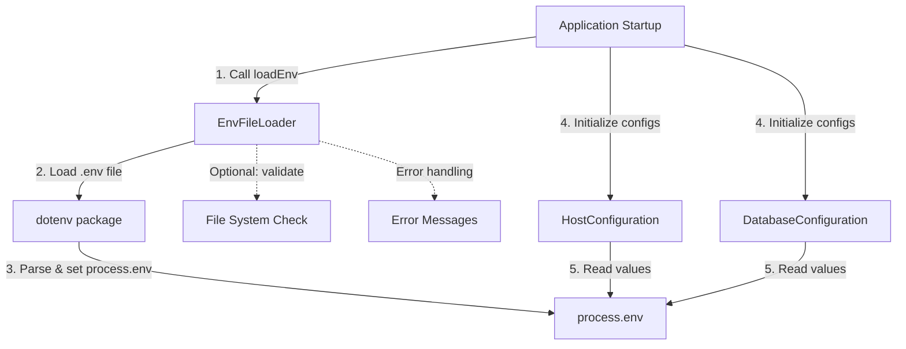

# System Design & Architecture: Environment File Loader

## Architecture Overview

**What is the high-level system structure?**



**Key Components:**

1. **EnvFileLoader**: Utility function/module that wraps dotenv and provides a simple API
2. **dotenv package**: Third-party library for parsing `.env` files
3. **Configuration Classes**: Existing HostConfiguration and DatabaseConfiguration (no changes needed)
4. **process.env**: Standard Node.js environment variables object

**Technology Stack:**

- **dotenv**: ^16.0.0 (industry standard, 50M+ weekly downloads, actively maintained)
- **Node.js fs module**: For optional file existence validation
- **TypeScript**: For type-safe API

**Rationale:**

- dotenv is the de facto standard for environment file loading in Node.js
- Keeping configuration classes unchanged maintains backward compatibility
- Synchronous loading during startup is acceptable for configuration initialization

## Data Models

**What data do we need to manage?**

### EnvLoaderOptions Interface

```typescript
interface EnvLoaderOptions {
    /**
     * Path to the environment file to load
     * Can be absolute or relative to process.cwd()
     * @default '.env'
     */
    path?: string;

    /**
     * Whether to override existing environment variables
     * @default false (dotenv's default behavior)
     */
    override?: boolean;

    /**
     * Whether to throw an error if the file doesn't exist
     * @default false
     */
    required?: boolean;

    /**
     * Encoding of the environment file
     * @default 'utf8'
     */
    encoding?: BufferEncoding;
}
```

### EnvLoaderResult Interface

```typescript
interface EnvLoaderResult {
    /**
     * Whether the environment file was successfully loaded
     */
    success: boolean;

    /**
     * Path that was attempted to load
     */
    path: string;

    /**
     * Error message if loading failed
     */
    error?: string;

    /**
     * Parsed environment variables (for debugging)
     */
    parsed?: Record<string, string>;
}
```

## API Design

**How do components communicate?**

### Primary API: `loadEnv` Function

```typescript
/**
 * Load environment variables from a file using dotenv
 *
 * @param options - Configuration options for loading
 * @returns Result object with loading status and details
 *
 * @example
 * // Load from default .env file
 * loadEnv();
 *
 * @example
 * // Load from custom path
 * loadEnv({ path: './config/.env.production' });
 *
 * @example
 * // Require file to exist
 * loadEnv({ path: '.env.local', required: true });
 */
export function loadEnv(options?: EnvLoaderOptions): EnvLoaderResult;
```

### Secondary API: `loadEnvOrThrow` Function

```typescript
/**
 * Load environment variables from a file, throwing if it fails
 *
 * @param options - Configuration options for loading
 * @throws {Error} If the file cannot be loaded
 *
 * @example
 * // Will throw if file doesn't exist
 * loadEnvOrThrow({ path: '.env.production' });
 */
export function loadEnvOrThrow(options?: EnvLoaderOptions): void;
```

### Usage Pattern

```typescript
// In app entry point (e.g., apps/host-root/src/main.tsx)
import { loadEnv } from "@page-builder/configurations";

// Load environment file before any configuration initialization
loadEnv({ path: ".env.local" });

// Now configuration classes will use the loaded values
const hostConfig = new HostConfiguration();
const dbConfig = new DatabaseConfiguration();
```

## Component Breakdown

**What are the major building blocks?**

### 1. `src/env-loader.ts` (New File)

**Responsibility**: Wrap dotenv and provide a clean API for loading environment files

**Key Functions:**

- `loadEnv()`: Main function for loading environment files
- `loadEnvOrThrow()`: Convenience function that throws on failure
- Internal helpers for path resolution and error handling

**Dependencies:**

- `dotenv` package
- Node.js `fs` module (for file existence checks)
- Node.js `path` module (for path resolution)

### 2. `src/index.ts` (Updated)

**Changes Needed:**

- Export `loadEnv` and `loadEnvOrThrow` functions
- Export `EnvLoaderOptions` and `EnvLoaderResult` types

### 3. Configuration Classes (No Changes)

**HostConfiguration** and **DatabaseConfiguration** remain unchanged:

- Continue reading from `process.env`
- Benefit automatically from loaded environment files
- No API changes required

### 4. `package.json` (Updated)

**Changes Needed:**

- Add `dotenv` as a production dependency
- Update build/test scripts if needed

## Design Decisions

**Why did we choose this approach?**

### Decision 1: Use dotenv Package

**Alternatives Considered:**

- Custom .env parser: More control but reinventing the wheel
- Other env loaders (e.g., env-cmd, cross-env): More features but heavier

**Chosen Approach:** dotenv

- Industry standard with massive adoption
- Simple, focused API
- Well-tested and reliable
- No lock-in (easy to switch if needed)

### Decision 2: Separate Utility Function vs. Modified Constructors

**Alternatives Considered:**

- Add env path parameter to configuration class constructors
- Create a ConfigurationFactory class

**Chosen Approach:** Separate `loadEnv()` utility function

- **Pros:**
    - No changes to existing configuration classes
    - More flexible (can load env files independently)
    - Easier to test
    - Can be called before any configuration initialization
- **Cons:**
    - Requires developers to remember to call it
    - Two-step process (load env, then create config)

### Decision 3: Synchronous Loading

**Alternatives Considered:**

- Async loading with Promises

**Chosen Approach:** Synchronous loading

- Configuration initialization is already synchronous
- Happens once at startup (performance not critical)
- Simpler API and error handling
- Matches dotenv's default behavior

### Decision 4: Optional File by Default

**Alternatives Considered:**

- Throw error if file not found
- Always require explicit path

**Chosen Approach:** Optional file loading with `required` flag

- Graceful degradation for environments that use process.env directly
- Backward compatible with existing deployments
- Explicit `required: true` option for strict environments

## Non-Functional Requirements

**How should the system perform?**

### Performance Targets

- Environment file loading: < 10ms for typical .env files (< 100 variables)
- No performance impact on runtime (loading happens once at startup)
- File parsing should be lazy (only when `loadEnv()` is called)

### Security Requirements

- **No logging of environment values**: Error messages should not expose sensitive data
- **File permissions respected**: Use Node.js default file access permissions
- **No environment variable leakage**: Parsed values only available via process.env
- Path traversal protection: Validate and sanitize file paths

### Error Handling

- **Clear error messages**: Include file path and specific failure reason
- **Graceful degradation**: Missing optional files should not crash the app
- **Validation errors**: Distinguish between missing files and parse errors

### Reliability

- **Idempotent**: Calling `loadEnv()` multiple times should be safe
- **No side effects**: Should not modify anything except process.env
- **Fail fast**: Required files should fail immediately with clear errors

## Implementation Checklist

- [ ] Install dotenv package
- [ ] Create `src/env-loader.ts` with `loadEnv()` and `loadEnvOrThrow()`
- [ ] Define TypeScript interfaces for options and result
- [ ] Implement file existence validation (optional)
- [ ] Implement error handling and clear error messages
- [ ] Export from `src/index.ts`
- [ ] Write comprehensive unit tests (100% coverage)
- [ ] Write integration tests with configuration classes
- [ ] Update package.json with dotenv dependency
- [ ] Document usage examples
- [ ] Update README with env file loading instructions
