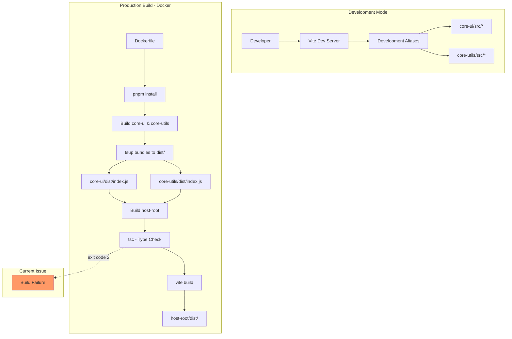

# System Design & Architecture

## Architecture Overview

**What is the high-level system structure?**



**Key components:**

- **Vite Dev Server**: Uses development aliases to resolve @page-builder/\* to source files
- **tsup**: Bundles core-ui and core-utils packages with esbuild, outputs to dist/
- **Docker Multi-stage Build**: Installs deps, builds packages in order, creates nginx image
- **TypeScript Compiler (tsc)**: Type-checks before Vite build in production

**Technology stack:**

- **Build**: tsup (esbuild wrapper) for libraries, Vite for applications
- **Package Manager**: pnpm with workspaces
- **Container**: Docker multi-stage build with node:24-alpine
- **CI/CD**: GitHub Actions with docker/build-push-action

## Root Cause Analysis

**What's causing the Docker build failure?**

After investigation, the issue is likely one of these scenarios:

### Scenario 1: Unused Alias Configuration

The [`tsup.config.ts`](../../../../../../C:/Users/base/Documents/kevid/page-builder-cms/packages/core/ui/tsup.config.ts#L15-L17) in core-ui has:

```typescript
esbuildOptions(options) {
    options.banner = { js: '"use client"' };
    options.alias = { "@": "./src" };  // ← Unused since we refactored to relative imports
}
```

**Problem**: This alias is defined but never used (code now uses relative imports). In some build contexts, this could cause confusion or resolution issues.

### Scenario 2: TypeScript Path Resolution in Docker

When `tsc` runs in Docker context, it might not properly resolve the `@page-builder/*` workspace packages because:

- Node module resolution in Docker might differ from local
- Symlinks created by pnpm might not work the same way
- TypeScript's module resolution might not find the built packages

### Scenario 3: Missing Type Definitions

The built `dist/index.d.ts` might not export all necessary types, causing TypeScript compilation errors in host-root.

## Design Decisions

**Solution Approach:**

### Option A: Remove Unused Alias (Low Risk) ✅ **RECOMMENDED**

```typescript
// tsup.config.ts - Remove unused alias
esbuildOptions(options) {
    options.banner = { js: '"use client"' };
    // Remove: options.alias = { "@": "./src" };
}
```

**Pros:**

- Simple, low-risk change
- Removes configuration that doesn't match current code
- Improves build clarity

**Cons:**

- Might not fix the issue if the problem is elsewhere

### Option B: Ensure Type Definitions Export

Verify that [`packages/core/ui/src/index.ts`](../../../../../../C:/Users/base/Documents/kevid/page-builder-cms/packages/core/ui/src/index.ts) exports all necessary types.

**Pros:**

- Ensures type safety across packages
- Might reveal missing exports

**Cons:**

- More investigation needed

### Option C: Add Explicit TypeScript Project References

Update host-root's [`tsconfig.json`](../../../../../../C:/Users/base/Documents/kevid/page-builder-cms/packages/host-root/tsconfig.json) to explicitly reference core packages.

**Pros:**

- Stronger TypeScript project relationship
- Better incremental builds

**Cons:**

- More complex configuration
- Might not be necessary with pnpm workspaces

### Option D: Modify Docker Build Order

Change Dockerfile to ensure proper module resolution.

**Pros:**

- Addresses Docker-specific issues
- Doesn't change source code

**Cons:**

- Might not be necessary
- Current order seems correct

## Component Breakdown

**What needs to be modified?**

### 1. tsup.config.ts (core-ui)

- **Current**: Has unused `@` alias in esbuildOptions
- **Change**: Remove the unused alias configuration
- **Impact**: Clarifies build configuration, removes potential confusion

### 2. Dockerfile (host-root & render-root)

- **Current**: Multi-stage build that works correctly
- **Change**: None expected (unless Option D is needed)
- **Impact**: N/A

### 3. TypeScript Configurations

- **Current**: host-root has path aliases for @ but not for workspace packages
- **Change**: Potentially add project references if needed
- **Impact**: Better TypeScript project awareness

## API Design

**How do components communicate?**

This is a build system fix, not an API change. The runtime API remains:

- host-root imports from `@page-builder/core-ui`
- Resolved to `node_modules/@page-builder/core-ui` (pnpm workspace link)
- Points to `packages/core/ui/dist/index.js` in production
- Points to `packages/core/ui/src/index.ts` in development (via Vite aliases)

## Non-Functional Requirements

**How should the system perform?**

### Build Performance

- Docker build time should remain under 5 minutes
- Layer caching should work effectively
- No significant impact on local development speed

### Reliability

- 100% success rate for Docker builds in CI/CD
- Consistent builds across different environments (local, CI, production)
- No intermittent failures

### Maintainability

- Configuration should be clear and self-documenting
- Unused config should be removed
- Build errors should have clear messages

## Testing Strategy

**How will we verify the fix?**

1. **Local Build Test**: Run `pnpm build` in host-root ✅ (Already passing)
2. **Docker Build Test**: Run `docker build -f packages/host-root/Dockerfile .`
3. **CI/CD Test**: Push to branch and verify GitHub Actions succeeds
4. **Development Mode Test**: Ensure HMR still works with dev aliases
5. **Production Runtime Test**: Verify built Docker image runs correctly

## Rollback Plan

**What if the fix doesn't work?**

- If removing alias doesn't fix it, add it back (simple git revert)
- If Docker build still fails, investigate actual CI logs for specific error
- Can temporarily skip Docker validation in CI while investigating
- No production impact since current production is working (just can't deploy new changes)
