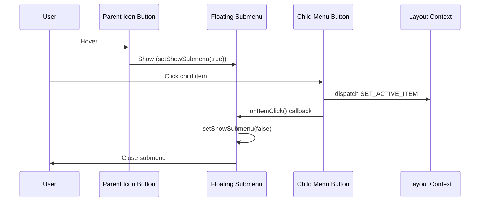

# Design: Fix Submenu Interaction

## Root Cause

After analyzing the code, the issue is:

1. Child menu items inside the floating submenu have `depth > 0`
2. They render as regular buttons (not in collapsed mode)
3. Their buttons have proper `onClick={handleClick}` handlers
4. **However**: The child buttons inside the submenu might need padding/styling fixes for better click targets
5. **Key issue**: Child items should close the parent submenu after being clicked

## Solution Design

### Option 1: Add submenu close on child click (Recommended)

When a child item inside a submenu is clicked:

1. Dispatch SET_ACTIVE_ITEM action (already happens)
2. Also close the parent submenu by calling `setShowSubmenu(false)`

**Problem:** Child components don't have access to parent's `setShowSubmenu`

**Solution:** Pass a callback function to close submenu

### Option 2: Better button styling for child items

Child menu items inside submenu might need better click targets:

- Add padding to child buttons
- Ensure hover states work
- Remove `ml-4` margin that might interfere

## Recommended Approach

**Implement both fixes:**

1. **Add close callback to submenu children**
    - Add `onItemClick` prop to MenuItemComponent
    - Pass callback from parent that closes submenu
    - Call callback after setting active item

2. **Improve child button styling in submenu**
    - Ensure child buttons have proper padding (`px-3 py-2`)
    - Remove left margin when rendering inside submenu
    - Add hover states

## Implementation Changes

### Change 1: Add onItemClick prop

```typescript
interface MenuItemComponentProps {
    item: MenuItem;
    depth?: number;
    isCollapsed?: boolean;
    onItemClick?: () => void; // NEW
}
```

### Change 2: Update handleClick

```typescript
const handleClick = React.useCallback(() => {
    if (hasChildren) {
        // ... existing logic
    } else {
        dispatch({ type: "SET_ACTIVE_ITEM", payload: item.id });
        onItemClick?.(); // NEW - call callback to close parent submenu
    }
}, [hasChildren, item.id, dispatch, isCollapsed, showSubmenu, onItemClick]);
```

### Change 3: Pass callback when rendering children

```typescript
{item.children?.map((child) => (
    <MenuItemComponent
        key={child.id}
        item={child}
        depth={depth + 1}
        isCollapsed={false}
        onItemClick={() => setShowSubmenu(false)} // NEW
    />
))}
```

### Change 4: Fix child button styling

```typescript
className={cn(
    "flex w-full items-center gap-3 rounded-lg px-3 py-2 text-sm transition-colors",
    "hover:bg-accent hover:text-accent-foreground",
    isActive && "bg-accent text-accent-foreground font-medium",
    depth > 0 && depth === 1 && "ml-0", // No margin for direct children in submenu
    depth > 1 && "ml-4" // Margin for nested items in expanded sidebar
)}
```

## Architecture Impact



## Testing Plan

1. Hover over collapsed icon with children
2. Verify submenu appears
3. Click on a child item
4. Verify child item becomes active (background changes)
5. Verify submenu closes after click
6. Verify active state persists in layout context
7. Test with multiple levels if applicable

## Performance Considerations

- Adding onItemClick callback is negligible overhead
- useCallback ensures no unnecessary re-renders
- No additional DOM elements or listeners needed
