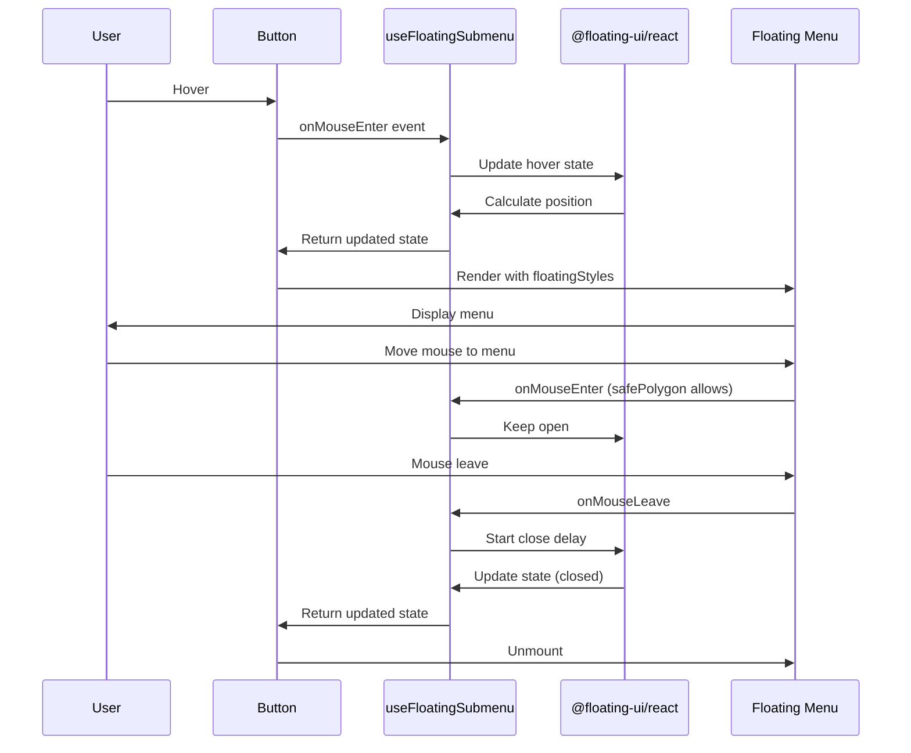

# System Design & Architecture: Floating Submenu Hook

## Architecture Overview

**High-level structure:**

```mermaid
graph TD
    SidebarMenuItem[SidebarMenuItem Component] -->|uses| useFloatingTooltip[useFloatingTooltip Hook]
    SidebarMenuItem -->|uses| useFloatingSubmenu[useFloatingSubmenu Hook]

    useFloatingTooltip -->|configures| FloatingUI[@floating-ui/react]
    useFloatingSubmenu -->|configures| FloatingUI

    useFloatingTooltip -->|returns| TooltipProps[Tooltip Props Object]
    useFloatingSubmenu -->|returns| SubmenuProps[Submenu Props Object]

    TooltipProps -->|spread onto| Button[Button Element]
    TooltipProps -->|spread onto| TooltipDiv[Tooltip Element]

    SubmenuProps -->|spread onto| Button
    SubmenuProps -->|spread onto| SubmenuDiv[Submenu Element]
```

**Key components:**

1. **useFloatingTooltip** - Custom hook for simple hover tooltips
2. **useFloatingSubmenu** - Custom hook for interactive dropdown menus
3. **SidebarMenuItem** - Consumer component (simplified)

**Technology stack:**

- @floating-ui/react for positioning and interactions
- React 19 hooks (useState, useMemo)
- TypeScript for type safety

## Hook API Design

### useFloatingTooltip

**Purpose:** Create a simple hover tooltip that appears near the trigger element

**Interface:**

```typescript
interface UseFloatingTooltipOptions {
    isOpen?: boolean;
    onOpenChange?: (open: boolean) => void;
    placement?: Placement; // "right" | "top" | "bottom" | "left"
    offset?: number;
    openDelay?: number;
    closeDelay?: number;
}

interface UseFloatingTooltipReturn {
    // Refs for trigger and tooltip elements
    refs: {
        setReference: (node: HTMLElement | null) => void;
        setFloating: (node: HTMLElement | null) => void;
    };
    // Styles to apply to floating element
    floatingStyles: React.CSSProperties;
    // Props to spread on trigger element
    getReferenceProps: (userProps?: React.HTMLProps<Element>) => Record<string, unknown>;
    // Props to spread on tooltip element
    getFloatingProps: (userProps?: React.HTMLProps<HTMLElement>) => Record<string, unknown>;
    // Current open state
    isOpen: boolean;
}
```

**Configuration defaults:**

- Placement: "right"
- Offset: 4px
- Open delay: 100ms
- Close delay: 200ms
- Middleware: offset, flip, shift with 8px padding
- Hover only (no focus/dismiss for simple tooltips)

### useFloatingSubmenu

**Purpose:** Create an interactive dropdown menu with safePolygon hover handling

**Interface:**

```typescript
interface UseFloatingSubmenuOptions {
    isOpen?: boolean;
    onOpenChange?: (open: boolean) => void;
    placement?: Placement; // "right-start" | "right" | "bottom-start" etc.
    offset?: number;
    openDelay?: number;
    closeDelay?: number;
}

interface UseFloatingSubmenuReturn {
    refs: {
        setReference: (node: HTMLElement | null) => void;
        setFloating: (node: HTMLElement | null) => void;
    };
    floatingStyles: React.CSSProperties;
    getReferenceProps: (userProps?: React.HTMLProps<Element>) => Record<string, unknown>;
    getFloatingProps: (userProps?: React.HTMLProps<HTMLElement>) => Record<string, unknown>;
    isOpen: boolean;
}
```

**Configuration defaults:**

- Placement: "right-start"
- Offset: 0px (no gap for smooth hover)
- Open delay: 50ms
- Close delay: 300ms
- Middleware: offset, flip, shift with 0px padding
- Hover with safePolygon for diagonal mouse movement
- Focus and dismiss handlers included
- Role: "menu"

## Component Breakdown

### File Structure

```
packages/core/ui/src/
├── hooks/
│   ├── index.ts                    # Export all hooks
│   ├── useFloatingTooltip.tsx     # NEW - Tooltip hook
│   └── useFloatingSubmenu.tsx     # NEW - Submenu hook (replaces empty file)
├── molecules/
│   └── SidebarMenuItem.tsx        # MODIFIED - Use new hooks
```

### useFloatingTooltip Implementation

```typescript
import { useState } from "react";
import {
    useFloating,
    autoUpdate,
    offset,
    flip,
    shift,
    useHover,
    useRole,
    useInteractions,
    type Placement
} from "@floating-ui/react";

export const useFloatingTooltip = (options: UseFloatingTooltipOptions = {}) => {
    const {
        isOpen: controlledOpen,
        onOpenChange: setControlledOpen,
        placement = "right",
        offset: offsetValue = 4,
        openDelay = 100,
        closeDelay = 200
    } = options;

    const [uncontrolledOpen, setUncontrolledOpen] = useState(false);
    const isOpen = controlledOpen ?? uncontrolledOpen;
    const setIsOpen = setControlledOpen ?? setUncontrolledOpen;

    const { refs, floatingStyles, context } = useFloating({
        open: isOpen,
        onOpenChange: setIsOpen,
        placement,
        whileElementsMounted: autoUpdate,
        middleware: [offset(offsetValue), flip(), shift({ padding: 8 })]
    });

    const hover = useHover(context, {
        delay: { open: openDelay, close: closeDelay },
        move: false
    });

    const role = useRole(context, { role: "tooltip" });

    const { getReferenceProps, getFloatingProps } = useInteractions([hover, role]);

    return {
        refs,
        floatingStyles,
        getReferenceProps,
        getFloatingProps,
        isOpen
    };
};
```

### useFloatingSubmenu Implementation

Similar structure but with:

- safePolygon in useHover
- useFocus and useDismiss hooks
- role: "menu"
- Different default delays

## Design Decisions

**1. Two separate hooks vs one configurable hook**

- **Decision:** Two separate hooks
- **Rationale:**
    - Tooltip and submenu have different interaction patterns
    - Separate hooks provide better TypeScript types
    - Clearer API - developer knows which to use
    - Future flexibility (tooltip might not need focus/dismiss)

**2. Controlled vs uncontrolled state**

- **Decision:** Support both patterns
- **Rationale:**
    - Uncontrolled by default (internal useState)
    - Accept isOpen/onOpenChange for controlled usage
    - Matches React conventions (like input value)
    - SidebarMenuItem needs controlled state

**3. Props spreading pattern**

- **Decision:** Return getReferenceProps and getFloatingProps functions
- **Rationale:**
    - Matches @floating-ui/react patterns
    - Allows users to merge their own props
    - Type-safe with React.HTMLProps
    - Standard pattern in React ecosystem

**4. Remove FloatingPortal**

- **Decision:** Don't include FloatingPortal in hooks
- **Rationale:**
    - Portal breaks hover interactions
    - Inline rendering works with proper z-index
    - Simpler mental model
    - Already proven in previous fix

**5. Default values**

- **Decision:** Sensible defaults based on current working config
- **Rationale:**
    - Tooltip: 4px offset, 100ms/200ms delays (less urgent)
    - Submenu: 0px offset, 50ms/300ms delays (needs quick access)
    - Placement based on sidebar use case (can be overridden)

## Data Flow



## Security & Performance Considerations

**Performance:**

- Hooks use useMemo internally to memoize middleware arrays
- autoUpdate efficiently tracks position changes
- No unnecessary re-renders (controlled state pattern)
- Event listeners properly cleaned up by Floating UI

**Accessibility:**

- Proper ARIA roles (tooltip, menu)
- Keyboard navigation support via useFocus
- Dismiss on Escape key via useDismiss
- Focus management handled by Floating UI

**Best Practices:**

- Type-safe interfaces
- Proper ref handling
- Memory leak prevention (cleanup in useEffect)
- Follows React hooks rules

## Migration Path

1. Create useFloatingTooltip hook
2. Create useFloatingSubmenu hook
3. Export from hooks/index.ts
4. Update SidebarMenuItem to use hooks
5. Remove inline Floating UI configuration
6. Test hover interactions
7. Verify build output size (should be similar or smaller)
