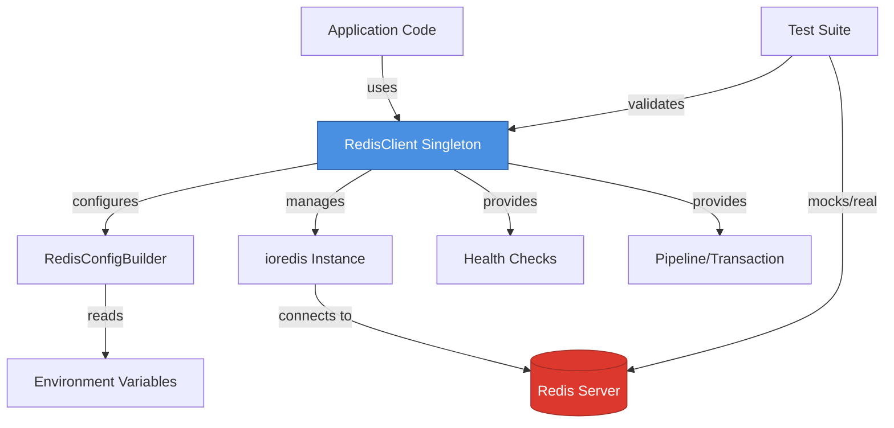

# System Design & Architecture: Redis Connection Layer

## Architecture Overview

**What is the high-level system structure?**



### Key Components

1. **RedisClient** - Singleton managing Redis connection lifecycle (mirrors PostgreSQL `DatabaseClient`)
2. **RedisConfigBuilder** - Builds ioredis configuration from environment variables (mirrors PostgreSQL `DatabaseConfigBuilder`)
3. **Health Check** - Provides connection status and latency metrics
4. **Pipeline Support** - Wrapper for Redis transactions/pipelines
5. **Type Definitions** - TypeScript interfaces and types

### Technology Stack

- **ioredis** (v5.x) - Robust Redis client with TypeScript support, connection pooling, clustering, and pipeline support
- **winston** - Logging (already in package, consistent with PostgreSQL)
- **vitest** - Testing framework (already configured)
- **TypeScript** - Type safety

### File Structure (mirroring PostgreSQL)

```
src/redis/
├── client.ts           # RedisClient singleton (like postgres/client.ts)
├── config.ts           # RedisConfigBuilder (like postgres/config.ts)
├── health.ts           # Health check utilities (like postgres/health.ts)
├── pipeline.ts         # Pipeline/transaction wrapper (like postgres/transaction.ts)
├── redis.type.ts       # TypeScript type definitions (like postgres/postgres.type.ts)
├── index.ts            # Public exports
└── __tests__/
    ├── client.test.ts
    ├── config.test.ts
    ├── health.test.ts
    └── pipeline.test.ts
```

## Data Models

**Configuration Interface**

```typescript
export interface RedisConfig {
    host: string;
    port: number;
    password?: string;
    db: number;
    family: 4 | 6; // IPv4 or IPv6
    tls?: boolean;
    keyPrefix?: string;
    retryStrategy?: (times: number) => number | void;
    maxRetriesPerRequest?: number;
    enableReadyCheck?: boolean;
    enableOfflineQueue?: boolean;
}

export interface RedisConfigOptions {
    config?: Partial<RedisConfig>;
    debug?: boolean;
}

export interface RedisHealthStatus {
    connected: boolean;
    latency: number; // milliseconds
    lastCheck: Date;
    error?: string;
}
```

## API Design

### RedisClient API

```typescript
class RedisClient {
    // Singleton access
    static getInstance(options?: RedisConfigOptions): RedisClient;

    // Connection management
    connect(): Promise<void>;
    disconnect(): Promise<void>;
    isConnected(): boolean;
    getClient(): Redis; // ioredis instance

    // Health checks
    checkHealth(): Promise<RedisHealthStatus>;

    // Pipeline support
    pipeline(): Pipeline;

    // Common operations (convenience wrappers)
    get(key: string): Promise<string | null>;
    set(key: string, value: string, ttl?: number): Promise<void>;
    del(key: string): Promise<void>;
    exists(key: string): Promise<boolean>;
}
```

### RedisConfigBuilder API

```typescript
class RedisConfigBuilder {
    constructor(options?: RedisConfigOptions);

    // Configuration methods
    setHost(host: string): this;
    setPort(port: number): this;
    setPassword(password: string): this;
    setDatabase(db: number): this;
    setTLS(enabled: boolean): this;

    // Build final config
    build(): RedisConfig;

    // Validation
    validate(): boolean;
    getConnectionString(): string; // For logging (without password)
}
```

## Component Breakdown

### 1. RedisClient (client.ts)

**Responsibilities:**

- Singleton pattern for application-wide Redis instance
- Connection lifecycle management (connect, disconnect, reconnect)
- Graceful shutdown handling
- Error handling and logging
- Expose ioredis client for advanced operations

**Key Methods:**

- `getInstance()` - Get singleton instance
- `connect()` - Establish Redis connection
- `disconnect()` - Close connection gracefully
- `getClient()` - Access underlying ioredis instance

### 2. RedisConfigBuilder (config.ts)

**Responsibilities:**

- Read configuration from environment variables
- Provide sensible defaults
- Support programmatic configuration override
- Validate configuration before connection

**Environment Variables:**

- `REDIS_HOST` (default: `localhost`)
- `REDIS_PORT` (default: `6379`)
- `REDIS_PASSWORD` (default: `undefined`)
- `REDIS_DB` (default: `0`)
- `REDIS_TLS` (default: `false`)
- `REDIS_KEY_PREFIX` (default: `undefined`)

### 3. Health Check (health.ts)

**Responsibilities:**

- Check connection status
- Measure operation latency
- Return structured health status

**Implementation:**

- Execute `PING` command and measure response time
- Return status object with connection state and latency

### 4. Pipeline Support (pipeline.ts)

**Responsibilities:**

- Wrapper around ioredis pipelines
- Support atomic operations
- Error handling for pipeline execution

**Usage Pattern:**

```typescript
const pipeline = redisClient.pipeline();
pipeline.set("key1", "value1");
pipeline.set("key2", "value2");
await pipeline.exec();
```

### 5. Type Definitions (redis.type.ts)

**Responsibilities:**

- Export all TypeScript interfaces
- Ensure type safety across the module

## Design Decisions

### 1. **Why ioredis over node-redis?**

- Better TypeScript support
- Built-in connection pooling
- Lua script support
- Better error handling
- Widely adopted in production systems

### 2. **Why singleton pattern?**

- Consistent with PostgreSQL implementation
- Prevents multiple connection instances
- Simplifies connection management across application

### 3. **Why mirror PostgreSQL structure?**

- Developer familiarity - same patterns across data layers
- Easier maintenance - similar code organization
- Consistent API - reduces learning curve

### 4. **Why not use Redis pub/sub initially?**

- Out of scope for basic caching use cases
- Can be added as enhancement later
- Keeps initial implementation focused

## Non-Functional Requirements

### Performance

- Connection pooling handled by ioredis (default pool size: 10)
- Pipeline support for bulk operations
- Connection latency < 5ms for local, < 50ms for remote

### Scalability

- Single Redis instance initially
- Design allows future cluster support

### Security

- Support TLS connections for production
- Password authentication
- No plaintext passwords in logs

### Reliability

- Automatic reconnection with exponential backoff
- Graceful degradation on connection failure
- Comprehensive error logging

### Testability

- 100% unit test coverage
- Integration tests with real Redis
- Mockable for dependent services
