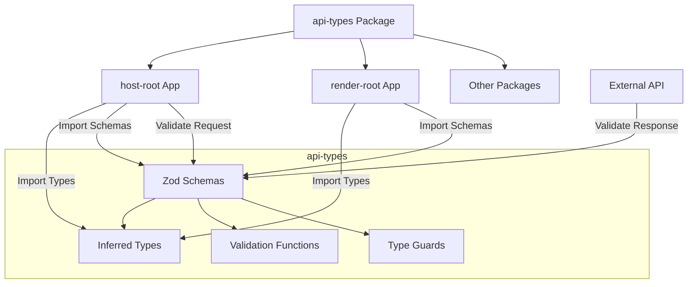

# System Design & Architecture - Shared API Schema

## Architecture Overview

**What is the high-level system structure?**



**Key components and their responsibilities:**

- **api-types**: Centralized package containing all Zod schemas and inferred TypeScript types
- **host-root**: Consumes types for API calls and client-side validation
- **render-root**: Consumes schemas for server-side/runtime validation
- **Validation utilities**: Helper functions for common validation patterns

**Technology stack:**

- Zod (v3.x) for schema definition and validation
- TypeScript (existing version) for type inference
- TSUP for bundling the package

## Data Models

**What data do we need to manage?**

### Core Entity Categories

1. **Authentication & Users**
    - User profile
    - Login credentials
    - Registration data
    - Password reset
    - Session/token data

2. **Page Management**
    - Page metadata (title, slug, status)
    - Page content (blocks, components)
    - Page settings
    - Version history

3. **Content Blocks**
    - Block types (text, image, video, etc.)
    - Block configuration
    - Block relationships

4. **Media Assets**
    - File metadata
    - Upload requests
    - Media library queries

5. **Common Types**
    - Pagination
    - Error responses
    - API responses (success/error wrappers)
    - Timestamps and metadata

### Schema Organization Structure

```
api-types/
├── src/
│   ├── index.ts              # Main export barrel
│   ├── common/               # Shared/reusable schemas
│   │   ├── pagination.ts
│   │   ├── response.ts
│   │   ├── error.ts
│   │   └── index.ts
│   ├── auth/                 # Authentication schemas
│   │   ├── login.ts
│   │   ├── register.ts
│   │   ├── user.ts
│   │   └── index.ts
│   ├── page/                 # Page management schemas
│   │   ├── page.ts
│   │   ├── page-content.ts
│   │   └── index.ts
│   ├── content/              # Content block schemas
│   │   ├── block.ts
│   │   └── index.ts
│   ├── media/                # Media asset schemas
│   │   ├── media.ts
│   │   ├── upload.ts
│   │   └── index.ts
│   └── utils/                # Validation utilities
│       ├── validators.ts
│       └── index.ts
├── package.json
├── tsconfig.json
└── tsup.config.ts
```

## API Design

**How do components communicate?**

### Schema Definition Pattern

Each API endpoint should have:

- **Request schema**: Validates incoming data
- **Response schema**: Validates/parses outgoing data
- **Inferred types**: TypeScript types for use in code

**Example pattern:**

```typescript
// auth/login.ts
import { z } from "zod";

// Request schema
export const LoginRequestSchema = z.object({
    email: z.string().email(),
    password: z.string().min(8),
    rememberMe: z.boolean().optional()
});

// Response schema
export const LoginResponseSchema = z.object({
    success: z.boolean(),
    data: z.object({
        token: z.string(),
        user: z.object({
            id: z.string(),
            email: z.string(),
            name: z.string()
        })
    })
});

// Inferred types
export type LoginRequest = z.infer<typeof LoginRequestSchema>;
export type LoginResponse = z.infer<typeof LoginResponseSchema>;
```

### Export Strategy

All schemas and types should be exported through barrel files:

```typescript
// src/index.ts
export * from "./common";
export * from "./auth";
export * from "./page";
export * from "./content";
export * from "./media";
export * from "./utils";
```

### Usage in Consumer Apps

**In host-root (client-side):**

```typescript
import { LoginRequest, LoginResponseSchema } from "@repo/api-types";

const loginData: LoginRequest = {
    email: "user@example.com",
    password: "password123"
};

const response = await api.post("/auth/login", loginData);
const validated = LoginResponseSchema.parse(response.data);
```

**In render-root (server-side):**

```typescript
import { LoginRequestSchema } from "@repo/api-types";

app.post("/auth/login", (req, res) => {
    const result = LoginRequestSchema.safeParse(req.body);
    if (!result.success) {
        return res.status(400).json({ errors: result.error });
    }
    // Process validated data
});
```

## Component Breakdown

**What are the major building blocks?**

### 1. Schema Definitions

- Zod schemas for each API endpoint
- Reusable schema primitives (email, URL, date, etc.)
- Composed schemas for complex types

### 2. Type Exports

- Inferred TypeScript types from schemas
- Type utilities (Partial, Pick, Omit variants)

### 3. Validation Utilities

- `safeValidate()` - Wrapper for safe validation with custom error handling
- `validateOrThrow()` - Validation that throws typed errors
- Custom Zod refinements for business logic

### 4. Package Configuration

- `package.json` - Dependencies and scripts
- `tsconfig.json` - TypeScript configuration
- `tsup.config.ts` - Build configuration

## Design Decisions

**Why did we choose this approach?**

### 1. Zod for Schema Definition

**Decision:** Use Zod as the single source of truth for both runtime validation and TypeScript types

**Rationale:**

- Type inference eliminates duplication
- Runtime validation prevents invalid data
- Excellent TypeScript integration
- Rich ecosystem and community support

**Alternatives considered:**

- io-ts: More complex API
- Yup: Weaker TypeScript integration
- Manual types + class-validator: Requires duplication

### 2. Schema Organization by Domain

**Decision:** Organize schemas by domain (auth, page, content) rather than by type (requests, responses)

**Rationale:**

- Better discoverability
- Related schemas stay together
- Easier to maintain and extend
- Mirrors application structure

### 3. Explicit Type Exports

**Decision:** Export both schemas and inferred types

**Rationale:**

- Consumers can choose validation vs types only
- Clear separation of concerns
- Better tree-shaking opportunities

### 4. Shared Utilities Package

**Decision:** Keep validation utilities in api-types vs external package

**Rationale:**

- Closely coupled with schema definitions
- Simplifies imports
- Easier to maintain consistency

## Non-Functional Requirements

**How should the system perform?**

### Performance

- Schema validation: < 1ms per typical request
- Bundle size: < 50KB minified for entire package
- Tree-shaking: Only import what's used

### Scalability

- Support for 50+ API endpoints without performance degradation
- Easy to add new schemas without refactoring

### Developer Experience

- Clear error messages from validation failures
- Auto-completion for all types
- Comprehensive JSDoc comments
- Example usage in comments

### Reliability

- 100% unit test coverage
- All schemas tested with valid and invalid data
- Type safety enforced at compile time
