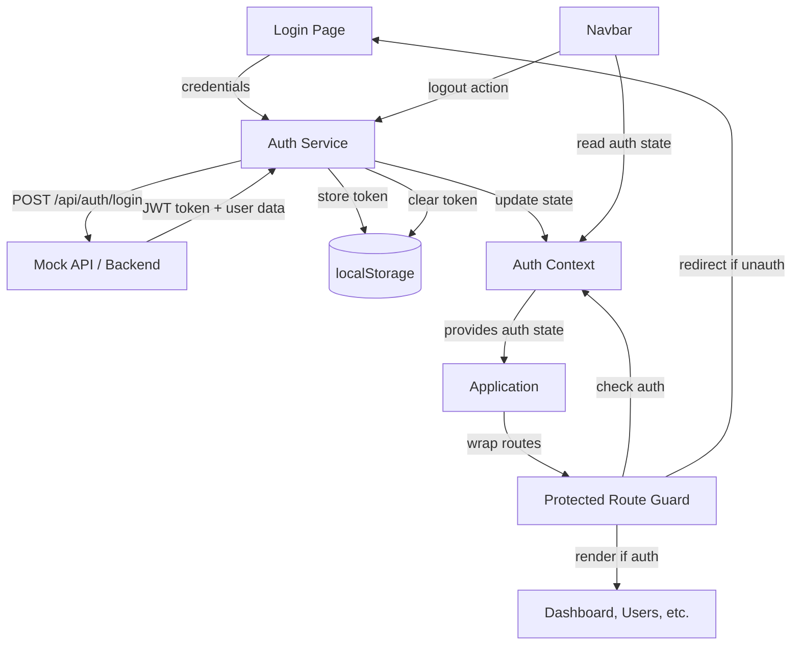

# System Design & Architecture - User Authentication

## Architecture Overview

**High-level system structure:**



**Key Components:**

1. **AuthContext & Provider**: Global authentication state management (React Context)
2. **AuthService**: Handles login, logout, token storage, and API communication
3. **ProtectedRoute**: Route guard component that checks authentication before rendering
4. **Login Page**: UI for user authentication with form validation
5. **useAuth Hook**: Custom hook to access auth state and methods throughout the app
6. **Token Storage**: localStorage-based persistence layer

**Technology Stack:**

- **State Management**: React Context API (no external state library needed for MVP)
- **HTTP Client**: Fetch API or axios (reuse existing api.service.ts)
- **Routing**: TanStack Router with beforeLoad guards
- **Storage**: localStorage for JWT token persistence
- **Form Handling**: Controlled components with React state (or react-hook-form)
- **Validation**: Client-side email/password validation

## Data Models

**Authentication Data Structures:**

```typescript
// User model
interface User {
    id: string;
    email: string;
    name: string;
    avatar?: string;
}

// Login credentials
interface LoginCredentials {
    email: string;
    password: string;
}

// Auth response from API
interface AuthResponse {
    token: string;
    user: User;
    expiresIn?: number; // Token expiration time in seconds
}

// Auth context state
interface AuthState {
    user: User | null;
    token: string | null;
    isAuthenticated: boolean;
    isLoading: boolean;
}

// Auth context split into state and actions
interface AuthContextType {
    state: AuthState;
    actions: AuthActions;
}

interface AuthActions {
    login: (credentials: LoginCredentials) => Promise<void>;
    logout: () => void;
    checkAuth: () => void;
}

// Token storage key
const AUTH_TOKEN_KEY = "auth_token";
const AUTH_USER_KEY = "auth_user";
```

**Data Flow:**

1. User submits login form → credentials sent to auth service
2. Auth service calls API → receives JWT token + user data
3. Token and user stored in localStorage + auth context state updated
4. Context notifies subscribers → UI updates (show user info, enable protected routes)
5. Protected routes check auth context → allow/deny access
6. On logout → clear localStorage + reset context → redirect to login

## API Design

**Authentication Endpoints:**

### POST /api/auth/login

**Request:**

```json
{
    "email": "user@example.com",
    "password": "securePassword123"
}
```

**Success Response (200):**

```json
{
    "token": "eyJhbGciOiJIUzI1NiIsInR5cCI6IkpXVCJ9...",
    "user": {
        "id": "user-123",
        "email": "user@example.com",
        "name": "John Doe",
        "avatar": "https://example.com/avatar.jpg"
    },
    "expiresIn": 86400
}
```

**Error Response (401):**

```json
{
    "error": "Invalid credentials",
    "message": "Email or password is incorrect"
}
```

**Mock Implementation:**

- Hardcoded valid credentials for testing: `admin@example.com` / `password123`
- Simulated 500ms network delay for realistic UX
- Returns mock JWT token and user data
- Designed for easy swap to real backend API

### GET /api/auth/me (Optional - Token Validation)

**Headers:** `Authorization: Bearer {token}`

**Success Response (200):**

```json
{
    "user": {
        "id": "user-123",
        "email": "user@example.com",
        "name": "John Doe"
    }
}
```

**Error Response (401):** Token expired or invalid

## Component Breakdown

### Frontend Components

**1. AuthProvider (`src/contexts/AuthContext.tsx`)**

- Wraps entire app to provide auth state globally
- Manages auth state (user, token, isAuthenticated, isLoading)
- Initializes auth state from localStorage on mount
- Provides login, logout, checkAuth methods

**2. Login Page (`src/routes/login.tsx`)**

- TanStack Router route component
- Login form with email and password fields
- Form validation (required fields, email format)
- Error message display
- Loading state during submission
- Redirects to dashboard or original route on success

**3. Protected Route Guard (TanStack Router `beforeLoad`)**

- Implemented in router configuration
- Checks authentication status before loading route
- Redirects to `/login?redirect={originalPath}` if unauthenticated
- Allows navigation if authenticated

**4. Compound Auth Hooks (`src/hooks/auth/`)**

- `useAuthState()`: Access auth state (user, token, isAuthenticated, isLoading)
- `useAuthActions()`: Access auth actions (login, logout, checkAuth)
- `useAuth()`: Convenience hook combining state + actions
- `useAuthUser()`: Access current user data (derived from state)
- Each hook throws error if used outside AuthProvider
- Enables selective re-renders and better performance

**5. Navbar Updates**

- Display user name/avatar when authenticated
- Show logout button when authenticated
- Hide user info when not authenticated

**6. Auth Service (`src/services/auth.service.ts`)**

- `login(credentials)`: Calls API, stores token, returns user data
- `logout()`: Clears localStorage and resets state
- `getStoredToken()`: Retrieves token from localStorage
- `getStoredUser()`: Retrieves user data from localStorage
- `setStoredAuth(token, user)`: Saves auth data to localStorage
- `clearStoredAuth()`: Removes auth data from localStorage

## Design Decisions

**Key Architectural Decisions:**

### 1. Why React Context for State Management?

- **Decision**: Use React Context API instead of Redux/Zustand
- **Rationale**: Auth state is relatively simple (user + token), Context is sufficient and reduces dependencies
- **Trade-off**: Less powerful dev tools, but simpler implementation
- **Alternative considered**: Zustand (more powerful but overkill for this use case)

### 2. Why localStorage for Token Storage?

- **Decision**: Store JWT in localStorage
- **Rationale**: Simple, persistent across sessions, works with SPA architecture
- **Trade-off**: Vulnerable to XSS attacks, but acceptable for MVP; HTTPS mitigates some risks
- **Alternative considered**: httpOnly cookies (more secure but requires backend CORS config)

### 3. Why TanStack Router beforeLoad Guards?

- **Decision**: Use TanStack Router's `beforeLoad` hook for route protection
- **Rationale**: Native router feature, integrates cleanly, supports redirects with original path
- **Trade-off**: Tightly coupled to router (but we're already using it)
- **Alternative considered**: Wrapper component (more flexible but less integrated)

### 4. Why Mock API Initially?

- **Decision**: Implement mock authentication service first
- **Rationale**: Allows frontend development to proceed independently, easy to swap later
- **Trade-off**: Need to replace with real API eventually
- **Alternative considered**: Wait for backend (blocks frontend development)

### 5. Why No Refresh Token?

- **Decision**: Single JWT token, no refresh token mechanism
- **Rationale**: Simplifies MVP, reduces complexity, shorter token lifespan acceptable
- **Trade-off**: User must re-login after token expires (UX impact)
- **Alternative considered**: Refresh token flow (adds complexity, defer to v2)

## Non-Functional Requirements

**Performance:**

- Login API response time < 2 seconds (mock: ~500ms)
- Auth state initialization < 100ms (localStorage read)
- Route protection check < 50ms (context read)
- No visible flicker during auth checks (show loading state)

**Security:**

- JWT tokens transmitted over HTTPS only (production)
- Input validation on login form (prevent injection)
- Token storage in localStorage (acknowledge XSS vulnerability)
- No sensitive data in JWT payload (user id, email only)
- Logout fully clears authentication artifacts

**Scalability:**

- Auth context re-render optimization (useMemo for context value)
- Minimal auth checks (cache auth state, don't re-check on every render)

**Reliability:**

- Handle network failures gracefully (show error messages)
- Handle expired tokens (auto-logout, redirect to login)
- Handle malformed tokens (treat as unauthenticated)

**Usability:**

- Clear error messages for login failures
- Loading indicators during async operations
- Remember original route for post-login redirect
- Logout button easily accessible
- Responsive design for mobile devices
