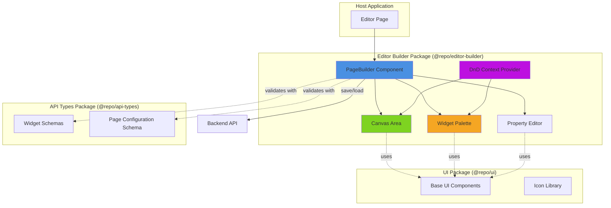

# System Design & Architecture: Visual Page Builder with Drag-and-Drop

## Architecture Overview

**What is the high-level system structure?**



### Key Components and Responsibilities

1. **PageBuilder Component**: Root orchestrator
    - Manages overall page state (list of widgets, selected widget)
    - Coordinates between Canvas, Palette, and PropertyEditor
    - Handles save/load operations
    - Provides DnD context

2. **Canvas Area**: The building area (left side)
    - Renders widgets in order
    - Handles drop events for new widgets
    - Handles reordering via drag-and-drop
    - Shows visual feedback for valid drop zones
    - Manages widget selection

3. **Widget Palette**: The widget library (right side)
    - Displays categorized list of available widgets
    - Handles drag initiation for new widgets
    - Shows widget previews/icons
    - May include search/filter functionality

4. **Property Editor**: Configuration panel
    - Displays properties for selected widget
    - Renders form inputs based on widget schema
    - Validates input against schema
    - Updates widget configuration in real-time

5. **DnD Context Provider**: Drag-and-drop state management
    - Wraps dnd-kit functionality
    - Manages drag sensors and collision detection
    - Handles drag events and state transitions

### Technology Stack

- **Framework**: React 18+ with TypeScript
- **DnD Library**: @dnd-kit/core, @dnd-kit/sortable
- **Schema Validation**: Zod (already used in api-types)
- **Styling**: Tailwind CSS (existing in project)
- **State Management**: React useState/useReducer (keep it simple initially)
- **UI Components**: Existing `@repo/ui` components

### Rationale

- **dnd-kit**: Modern, accessible, performant drag-and-drop library with React hooks
- **Zod integration**: Leverage existing widget schemas for validation
- **Local state**: Avoid complexity of global state management for contained feature
- **Monorepo structure**: Keep editor logic in `@repo/editor-builder`, separate from host

## Data Models

**What data do we need to manage?**

### Page Configuration Schema

```typescript
// Add to @repo/api-types/src/page/schema.ts (new file)

import { z } from "zod";
import { baseWidgetSchema } from "../widgets/schemas";

/**
 * A page is a collection of widgets with metadata
 */
export const pageConfigSchema = z.object({
    id: z.string().uuid(),
    title: z.string().min(1).max(200),
    slug: z.string().regex(/^[a-z0-9-]+$/),
    widgets: z.array(baseWidgetSchema), // Ordered array
    metadata: z.object({
        createdAt: z.string().datetime(),
        updatedAt: z.string().datetime(),
        createdBy: z.string().optional(),
        status: z.enum(["draft", "published", "archived"]).default("draft")
    }),
    settings: z
        .object({
            seoTitle: z.string().optional(),
            seoDescription: z.string().optional(),
            allowIndexing: z.boolean().default(true)
        })
        .optional()
});

export type PageConfig = z.infer<typeof pageConfigSchema>;
```

### Widget Instance Schema

Widgets are already defined in `@repo/api-types/src/widgets/schemas.ts`. Each widget instance will have:

- `id`: Unique identifier (UUID)
- `type`: Widget type enum
- `position`: Order in the page (0-indexed)
- `commonProps`: Common styling properties
- `props`: Widget-specific properties

### Editor State Model

```typescript
// Internal state within PageBuilder component

interface EditorState {
    page: PageConfig | null; // Current page being edited
    selectedWidgetId: string | null; // Currently selected widget for editing
    dragState: {
        isDragging: boolean;
        draggedWidgetId: string | null;
        draggedWidgetType: string | null; // For new widgets from palette
    };
    isDirty: boolean; // Has unsaved changes
    isSaving: boolean; // Save operation in progress
}
```

### Data Flow

1. **Page Load**: Fetch PageConfig from API → Populate EditorState
2. **Add Widget**: User drags from Palette → Create new widget instance → Add to page.widgets → Update positions
3. **Reorder Widget**: User drags in Canvas → Update positions in page.widgets
4. **Edit Widget**: User selects widget → Open PropertyEditor → Update widget.props
5. **Save Page**: User clicks save → Validate page.widgets → POST to API → Update metadata

## API Design

**How do components communicate?**

### Backend API Endpoints (to be implemented or integrated)

```typescript
// Assuming REST API

// Get page by ID
GET /api/pages/:pageId
Response: PageConfig

// List pages (for page selection)
GET /api/pages?status=draft&limit=20
Response: { pages: PageConfig[], total: number }

// Create new page
POST /api/pages
Body: Partial<PageConfig>
Response: PageConfig

// Update page
PUT /api/pages/:pageId
Body: PageConfig
Response: PageConfig

// Delete page (optional)
DELETE /api/pages/:pageId
Response: { success: boolean }
```

### Component Props Interfaces

```typescript
// PageBuilder.tsx
interface PageBuilderProps {
    pageId?: string; // If editing existing page
    onSave?: (page: PageConfig) => void; // Callback after save
    onCancel?: () => void; // Callback for cancel action
    readOnly?: boolean; // View-only mode
}

// Canvas.tsx
interface CanvasProps {
    widgets: BaseWidget[];
    selectedWidgetId: string | null;
    onWidgetSelect: (widgetId: string) => void;
    onWidgetDrop: (widgetData: NewWidgetData, position: number) => void;
    onWidgetReorder: (widgetId: string, newPosition: number) => void;
    onWidgetRemove: (widgetId: string) => void;
}

// WidgetPalette.tsx
interface WidgetPaletteProps {
    availableWidgets: WidgetDefinition[];
    categories?: WidgetCategory[];
    onDragStart?: (widgetType: string) => void;
}

// PropertyEditor.tsx
interface PropertyEditorProps {
    widget: BaseWidget | null;
    onPropertyChange: (widgetId: string, updates: Partial<BaseWidget>) => void;
    onClose: () => void;
}
```

### Internal Events

- `widget:added` - New widget added to canvas
- `widget:reordered` - Widget position changed
- `widget:selected` - Widget selected for editing
- `widget:updated` - Widget properties changed
- `widget:removed` - Widget removed from canvas
- `page:save:start` - Save operation initiated
- `page:save:success` - Save completed successfully
- `page:save:error` - Save failed

## Component Breakdown

**What are the major building blocks?**

### 1. PageBuilder (Root Component)

**Location**: `packages/core/editor-builder/src/components/PageBuilder/PageBuilder.tsx`

**Responsibilities**:

- Fetch and load page data
- Manage editor state (widgets, selection, dirty flag)
- Coordinate drag-and-drop operations
- Handle save/load operations
- Provide context to child components

**Key Hooks**:

- `usePageEditor()` - Custom hook for state management
- `useDndContext()` - From dnd-kit

### 2. Canvas Component

**Location**: `packages/core/editor-builder/src/components/PageBuilder/Canvas.tsx`

**Responsibilities**:

- Render widgets in order using `position` field
- Handle drop zones for new widgets and reordering
- Show visual feedback during drag operations
- Handle widget selection clicks
- Display empty state when no widgets

**Sub-components**:

- `CanvasWidget` - Wrapper around each widget with drag handle
- `DropZone` - Visual indicator for valid drop areas
- `EmptyCanvas` - Placeholder when canvas is empty

### 3. WidgetPalette Component

**Location**: `packages/core/editor-builder/src/components/PageBuilder/WidgetPalette.tsx`

**Responsibilities**:

- Display categorized widget list
- Render widget cards with preview/icon
- Handle drag initiation for new widgets
- Optional: Search/filter widgets

**Sub-components**:

- `WidgetCard` - Individual widget in palette
- `WidgetCategory` - Collapsible category section

**Widget Categories**:

- Promotional: hero_banner, flash_sale
- Content: product_grid, quick_links
- (Future: forms, media, navigation, etc.)

### 4. PropertyEditor Component

**Location**: `packages/core/editor-builder/src/components/PageBuilder/PropertyEditor.tsx`

**Responsibilities**:

- Display property form for selected widget
- Dynamically generate form fields based on widget schema
- Validate input using Zod schema
- Update widget properties on change
- Show validation errors

**Sub-components**:

- `PropertyField` - Dynamic field renderer (text, number, color, spacing, etc.)
- `CommonPropsEditor` - Editor for common properties (padding, margin, background)
- `SchemaFormGenerator` - Generates form from Zod schema

### 5. Widget Renderer Components

**Location**: `packages/core/editor-builder/src/components/WidgetRenderer/`

**Responsibilities**:

- Render each widget type for canvas preview
- Apply commonProps (padding, margin, backgroundColor, hidden)
- Show placeholder for incomplete widgets

**Components**:

- `HeroBannerWidget.tsx`
- `FlashSaleWidget.tsx`
- `ProductGridWidget.tsx`
- `QuickLinksWidget.tsx`
- `WidgetRenderer.tsx` - Factory component

### 6. DnD Integration Layer

**Location**: `packages/core/editor-builder/src/hooks/useDragAndDrop.ts`

**Responsibilities**:

- Configure dnd-kit sensors
- Define droppable areas
- Handle collision detection
- Manage drag overlay
- Transform drag events into editor actions

**Key dnd-kit Concepts**:

- `DndContext` - Root provider
- `useDraggable` - For palette widgets and canvas widgets
- `useDroppable` - For canvas drop zones
- `useSortable` - For reordering widgets in canvas
- `DragOverlay` - Preview during drag

## Design Decisions

**Why did we choose this approach?**

### Decision 1: Use dnd-kit over react-beautiful-dnd

**Rationale**:

- dnd-kit is more modern and actively maintained
- Better performance with virtualized lists
- More flexible and composable API
- Better TypeScript support
- Supports multiple drag contexts (palette → canvas, canvas reorder)

**Trade-offs**:

- Slightly steeper learning curve
- More boilerplate for setup

### Decision 2: Widget schemas defined in api-types package

**Rationale**:

- Single source of truth for widget structure
- Shared between editor, renderer, and backend
- Validation logic is centralized
- Type safety across packages

**Alternatives Considered**:

- Define schemas in editor-builder: Would create duplication
- Use JSON schema instead of Zod: Zod provides better TypeScript integration

### Decision 3: Local state management (no Redux/Zustand)

**Rationale**:

- Page builder is a self-contained feature
- State doesn't need to be shared outside the component tree
- Simpler to reason about and test
- Can refactor to global state later if needed

**Trade-offs**:

- Harder to implement undo/redo (would be easier with centralized state)
- Future collaborative features might require refactor

### Decision 4: Separate Canvas and Palette components

**Rationale**:

- Clear separation of concerns
- Each component has distinct drag-and-drop behavior
- Easier to test and maintain
- Follows single responsibility principle

### Decision 5: Dynamic form generation from Zod schemas

**Rationale**:

- Avoids manual form creation for each widget type
- Automatically stays in sync with schema changes
- Reduces boilerplate code
- Can be reused for other schema-driven forms

**Trade-offs**:

- More complex implementation initially
- Less control over custom layouts for specific widgets
- May need escape hatches for complex widgets

## Non-Functional Requirements

**How should the system perform?**

### Performance Targets

- **Drag operations**: 60fps (16ms frame time)
- **Page load**: < 2 seconds for 50 widgets
- **Save operation**: < 500ms
- **Canvas render**: < 100ms for 20 widgets
- **Property editor**: < 50ms to open/close

**Optimization Strategies**:

- Use React.memo for widget components
- Virtualize widget palette for large lists
- Debounce property changes
- Optimize re-renders with proper key props

### Scalability Considerations

- Support up to 100 widgets per page
- Handle pages with large widgets (images, grids)
- Efficient state updates (immutable patterns)
- Code splitting for widget renderers

### Security Requirements

- Validate all widget data against schemas before saving
- Sanitize user input in property editor
- Implement CSRF protection for save API
- Check permissions before allowing edit operations
- Prevent XSS in widget content (especially text/HTML widgets)

### Accessibility Requirements

- Full keyboard navigation support
    - Tab through widgets
    - Arrow keys to reorder
    - Enter to select
    - Delete key to remove
- Screen reader announcements for drag operations
- ARIA labels and roles
- Focus management (trap focus in modal editors)
- Sufficient color contrast (WCAG AA minimum)

### Reliability & Error Handling

- Graceful degradation if API is unavailable
- Auto-save drafts to localStorage
- Recover unsaved changes after browser crash
- Clear error messages for validation failures
- Retry logic for network errors
- Optimistic updates with rollback on failure

### Browser Compatibility

- Chrome 90+
- Firefox 88+
- Safari 14+
- Edge 90+

### Responsive Design

- Initial version: Desktop only (1280px+ width)
- Future: Tablet and mobile support
- Editor UI should not be responsive (desktop-first tool)
- Widget previews should show desktop view

## Open Design Questions

- [ ] Should we implement auto-save or require explicit save action?
- [ ] How do we handle concurrent edits (if two users edit same page)?
- [ ] Should widget removal be soft delete with undo, or hard delete with confirmation?
- [ ] Do we need a zoom/scale feature for canvas?
- [ ] Should there be preset templates/starter pages?
- [ ] How do we handle widget validation errors during save?
- [ ] Should property changes be applied immediately or on blur/save?
