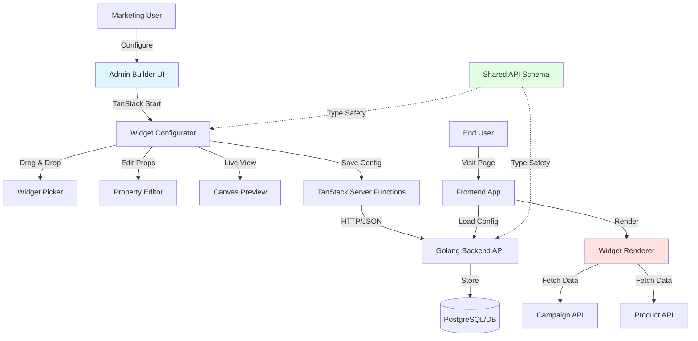
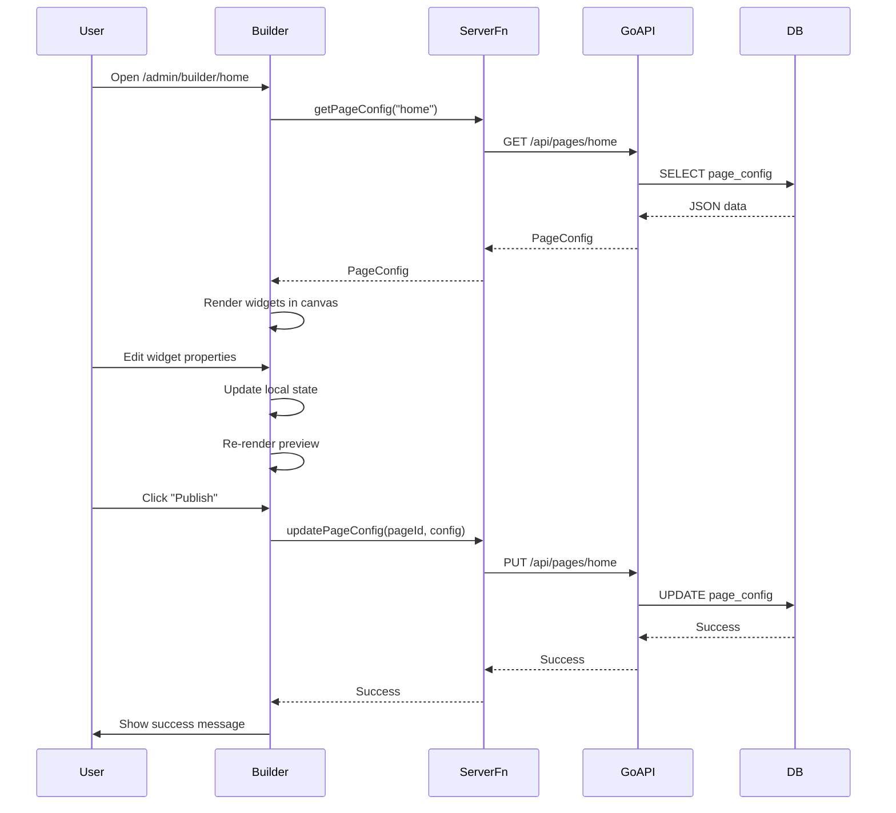

# System Design & Architecture

## Architecture Overview

**What is the high-level system structure?**

The Widget Builder System follows a Server-Driven UI architecture where page configurations are defined as JSON on the backend and dynamically rendered on the frontend. This enables non-technical users to modify content without code deployments.



### Key Components and Responsibilities

1. **Base Form Components** (`packages/core/ui/components/forms/`)
    - Reusable form inputs (Input, Select, Radio, Checkbox, Textarea)
    - Consistent styling with Dark Mode support
    - ForwardRef support for form library integration

2. **Widget Type System** (`packages/core/api-types/widgets/`)
    - TypeScript interfaces defining widget structure
    - Zod schemas for runtime validation
    - Shared between frontend and backend

3. **Widget Renderer** (`packages/host-root/src/components/WidgetRenderer.tsx`)
    - Receives widget configuration JSON
    - Maps widget types to React components
    - Handles data fetching for dynamic widgets

4. **Admin Builder UI** (`packages/host-root/src/pages/admin/builder/$pageId.tsx`)
    - 3-column layout (Picker, Canvas, Editor)
    - State management for widget configuration
    - Drag-and-drop orchestration

5. **Server Functions** (`packages/host-root/src/server/widgets.ts`)
    - TanStack Start server functions
    - API calls to Golang backend
    - Authentication/authorization checks

6. **Golang Backend** (external to this repo)
    - REST API for CRUD operations on page configs
    - Validation using shared schemas
    - Database persistence

### Technology Stack Choices

| Layer              | Technology                   | Rationale                                                                |
| ------------------ | ---------------------------- | ------------------------------------------------------------------------ |
| Frontend Framework | TanStack Start               | Project requirement, provides SSR and file-based routing                 |
| UI Components      | React 18 + TypeScript        | Type safety, component reusability, forwardRef support                   |
| Styling            | TailwindCSS + Dark Mode      | Utility-first, existing project standard                                 |
| Drag & Drop        | @dnd-kit/core                | Modern, accessible, works with React 18, better than react-beautiful-dnd |
| Schema Validation  | Zod                          | Runtime type safety, TypeScript integration, composable                  |
| State Management   | TanStack Query + React State | Server state caching, optimistic updates                                 |
| Backend            | Golang (existing)            | High performance, existing infrastructure                                |

## Data Models

**What data do we need to manage?**

### Core Entities

```typescript
// Page Configuration (root entity)
interface PageConfig {
    id: string;
    slug: string; // URL path, e.g., "home", "flash-sale-2024"
    title: string;
    status: "draft" | "published" | "archived";
    widgets: Widget[];
    metadata: {
        createdBy: string;
        createdAt: string; // ISO 8601
        updatedBy: string;
        updatedAt: string;
        publishedAt?: string;
        version: number;
    };
}

// Widget (polymorphic base)
interface BaseWidget {
    id: string; // unique within page
    type: WidgetType;
    position: number; // order on page
    commonProps: {
        padding?: Spacing;
        margin?: Spacing;
        backgroundColor?: string; // hex color
        hidden?: boolean;
    };
}

type WidgetType = "hero_banner" | "flash_sale" | "product_grid" | "quick_links";

type Widget = HeroBannerWidget | FlashSaleWidget | ProductGridWidget | QuickLinksWidget;

// Specific Widget Types
interface HeroBannerWidget extends BaseWidget {
    type: "hero_banner";
    props: {
        imageUrl: string;
        imageAlt: string;
        title?: string;
        subtitle?: string;
        ctaText?: string;
        ctaLink?: string;
        textPosition: "left" | "center" | "right";
        overlayOpacity: number; // 0-100
    };
}

interface FlashSaleWidget extends BaseWidget {
    type: "flash_sale";
    props: {
        campaignId: string; // references campaign from backend API
        countdownEndTime: string; // ISO 8601
        displayStyle: "grid" | "carousel";
        productsPerRow?: number; // for grid style
        showCountdown: boolean;
    };
}

interface ProductGridWidget extends BaseWidget {
    type: "product_grid";
    props: {
        dataSource: "featured" | "best_sellers" | "category" | "custom";
        categoryId?: string; // if dataSource is 'category'
        productIds?: string[]; // if dataSource is 'custom'
        limit: number;
        columns: number; // responsive handled via Tailwind
    };
}

interface QuickLinksWidget extends BaseWidget {
    type: "quick_links";
    props: {
        links: Array<{
            id: string;
            label: string;
            url: string;
            icon?: string; // icon name from icon library
        }>;
        layout: "horizontal" | "grid";
    };
}

// Utility Types
interface Spacing {
    top?: number;
    right?: number;
    bottom?: number;
    left?: number;
}
```

### Data Flow



## API Design

**How do components communicate?**

### Frontend to Backend API

All communication goes through TanStack Start server functions for security (API keys not exposed to client).

#### Server Functions (TanStack Start)

```typescript
// packages/host-root/src/server/widgets.ts

import { createServerFn } from "@tanstack/start";

// Get page configuration
export const getPageConfig = createServerFn("GET", async (slug: string) => {
    const response = await fetch(`${process.env.API_BASE_URL}/api/pages/${slug}`, {
        headers: {
            Authorization: `Bearer ${getServerSession().token}`
        }
    });
    if (!response.ok) throw new Error("Failed to fetch page config");
    return response.json() as Promise<PageConfig>;
});

// Save page configuration
export const updatePageConfig = createServerFn("POST", async (pageId: string, config: PageConfig) => {
    // Validate with Zod before sending
    const validated = pageConfigSchema.parse(config);

    const response = await fetch(`${process.env.API_BASE_URL}/api/pages/${pageId}`, {
        method: "PUT",
        headers: {
            Authorization: `Bearer ${getServerSession().token}`,
            "Content-Type": "application/json"
        },
        body: JSON.stringify(validated)
    });
    if (!response.ok) throw new Error("Failed to update page config");
    return response.json();
});

// Get campaign data (for Flash Sale widget)
export const getCampaignData = createServerFn("GET", async (campaignId: string) => {
    const response = await fetch(`${process.env.API_BASE_URL}/api/campaigns/${campaignId}`, {
        headers: { Authorization: `Bearer ${getServerSession().token}` }
    });
    if (!response.ok) throw new Error("Failed to fetch campaign");
    return response.json() as Promise<Campaign>;
});
```

#### Golang Backend API (Specification for Backend Team)

**Base URL**: `https://api.example.com/api`

**Authentication**: JWT Bearer token in `Authorization` header

**Endpoints**:

1. **GET /pages/:slug**
    - Fetch page configuration by slug
    - Response: `PageConfig` JSON
    - Status: 200 OK, 404 Not Found

2. **PUT /pages/:id**
    - Update page configuration
    - Request Body: `PageConfig` JSON
    - Response: Updated `PageConfig`
    - Status: 200 OK, 400 Bad Request, 403 Forbidden

3. **POST /pages**
    - Create new page configuration
    - Request Body: `Partial<PageConfig>` (id generated by server)
    - Response: Created `PageConfig`
    - Status: 201 Created, 400 Bad Request

4. **GET /campaigns/:id**
    - Fetch campaign details for Flash Sale widget
    - Response: `Campaign` JSON (includes product list)
    - Status: 200 OK, 404 Not Found

5. **GET /products**
    - Fetch products for Product Grid widget
    - Query params: `?featured=true`, `?category=:id`, `?ids=:id1,:id2`, `?limit=20`
    - Response: `{ products: Product[] }`
    - Status: 200 OK

### Validation Strategy

**Shared Schema Location**: `packages/core/api-types/src/widgets/schemas.ts`

```typescript
import { z } from "zod";

const spacingSchema = z.object({
    top: z.number().optional(),
    right: z.number().optional(),
    bottom: z.number().optional(),
    left: z.number().optional()
});

const baseWidgetSchema = z.object({
    id: z.string().uuid(),
    type: z.enum(["hero_banner", "flash_sale", "product_grid", "quick_links"]),
    position: z.number().int().min(0),
    commonProps: z.object({
        padding: spacingSchema.optional(),
        margin: spacingSchema.optional(),
        backgroundColor: z
            .string()
            .regex(/^#[0-9A-Fa-f]{6}$/)
            .optional(),
        hidden: z.boolean().optional()
    })
});

export const heroBannerSchema = baseWidgetSchema.extend({
    type: z.literal("hero_banner"),
    props: z.object({
        imageUrl: z.string().url(),
        imageAlt: z.string(),
        title: z.string().optional(),
        subtitle: z.string().optional(),
        ctaText: z.string().optional(),
        ctaLink: z.string().url().optional(),
        textPosition: z.enum(["left", "center", "right"]),
        overlayOpacity: z.number().min(0).max(100)
    })
});

// ... similar schemas for other widget types

export const widgetSchema = z.discriminatedUnion("type", [
    heroBannerSchema,
    flashSaleSchema,
    productGridSchema,
    quickLinksSchema
]);

export const pageConfigSchema = z.object({
    id: z.string().uuid(),
    slug: z.string().regex(/^[a-z0-9-]+$/),
    title: z.string().min(1).max(200),
    status: z.enum(["draft", "published", "archived"]),
    widgets: z.array(widgetSchema),
    metadata: z.object({
        createdBy: z.string(),
        createdAt: z.string().datetime(),
        updatedBy: z.string(),
        updatedAt: z.string().datetime(),
        publishedAt: z.string().datetime().optional(),
        version: z.number().int().min(1)
    })
});

export type PageConfig = z.infer<typeof pageConfigSchema>;
export type Widget = z.infer<typeof widgetSchema>;
// ... export other types
```

## Component Breakdown

**What are the major building blocks?**

### Frontend Components (packages/host-root/src/)

#### 1. Base Form Components (packages/core/ui/src/components/forms/)

- **Input.tsx**: Text/number/email/password input with label, error, helper text
- **Select.tsx**: Single and multi-select dropdown
- **Radio.tsx**: Radio button group
- **Checkbox.tsx**: Checkbox with label
- **Textarea.tsx**: Multi-line text input with auto-resize option
- **formClasses.ts**: Shared Tailwind class definitions for consistent styling

**Key Features**:

- ForwardRef for react-hook-form compatibility
- Dark Mode support via Tailwind `dark:` classes
- Consistent spacing and borders
- Accessibility (ARIA labels, keyboard navigation)

#### 2. Widget Renderer (pages/components/WidgetRenderer/)

- **WidgetRenderer.tsx**: Main component that maps widget type to specific component
- **HeroBanner.tsx**: Renders hero banner with image and CTA
- **FlashSale.tsx**: Renders flash sale with countdown timer and product grid
- **ProductGrid.tsx**: Fetches and renders product grid
- **QuickLinks.tsx**: Renders quick link buttons/grid

```typescript
// WidgetRenderer.tsx structure
const widgetComponents = {
  hero_banner: HeroBanner,
  flash_sale: FlashSale,
  product_grid: ProductGrid,
  quick_links: QuickLinks,
} as const;

export function WidgetRenderer({ widgets }: { widgets: Widget[] }) {
  return (
    <>
      {widgets.map((widget) => {
        const Component = widgetComponents[widget.type];
        return <Component key={widget.id} config={widget} />;
      })}
    </>
  );
}
```

#### 3. Admin Builder (pages/admin/builder/$pageId.tsx)

**Layout**: 3-column grid

```
┌────────────────────────────────────────────────────────────┐
│  Header (Save Draft | Publish | Preview Mode)              │
├──────────────┬─────────────────────────┬───────────────────┤
│              │                         │                   │
│  Widget      │   Canvas                │  Property         │
│  Picker      │   (Drag & Drop Preview) │  Editor           │
│              │                         │                   │
│  - Hero      │   ┌─────────────────┐   │  ┌─────────────┐ │
│  - Flash     │   │ Widget 1        │   │  │ Widget Props│ │
│  - Product   │   └─────────────────┘   │  │             │ │
│  - Quick     │   ┌─────────────────┐   │  │ [Form]      │ │
│              │   │ Widget 2        │   │  │             │ │
│              │   └─────────────────┘   │  └─────────────┘ │
│              │                         │                   │
└──────────────┴─────────────────────────┴───────────────────┘
```

**Sub-components**:

- **WidgetPicker.tsx**: Left sidebar with draggable widget cards
- **Canvas.tsx**: Center preview area with drop zones
- **PropertyEditor.tsx**: Right sidebar with forms for selected widget
- **ToolbarActions.tsx**: Header with save/publish buttons

#### 4. State Management

Use React Context + TanStack Query for builder state:

```typescript
// BuilderContext.tsx
interface BuilderState {
    pageConfig: PageConfig;
    selectedWidgetId: string | null;
    isDirty: boolean;
}

interface BuilderActions {
    addWidget: (widget: Widget, position: number) => void;
    updateWidget: (id: string, updates: Partial<Widget>) => void;
    deleteWidget: (id: string) => void;
    reorderWidget: (id: string, newPosition: number) => void;
    selectWidget: (id: string | null) => void;
}
```

### Backend Services (External Golang API)

1. **Page Config Service**: CRUD operations for page configurations
2. **Campaign Service**: Fetch campaign details for Flash Sale widget
3. **Product Service**: Fetch products for Product Grid widget
4. **Auth Middleware**: Validate JWT tokens, enforce permissions

### Database Schema (Suggested for Backend Team)

```sql
-- pages table
CREATE TABLE pages (
  id UUID PRIMARY KEY DEFAULT gen_random_uuid(),
  slug VARCHAR(255) UNIQUE NOT NULL,
  title VARCHAR(255) NOT NULL,
  status VARCHAR(20) NOT NULL CHECK (status IN ('draft', 'published', 'archived')),
  config JSONB NOT NULL, -- stores entire PageConfig as JSON
  created_by VARCHAR(255) NOT NULL,
  created_at TIMESTAMP NOT NULL DEFAULT NOW(),
  updated_by VARCHAR(255) NOT NULL,
  updated_at TIMESTAMP NOT NULL DEFAULT NOW(),
  published_at TIMESTAMP,
  version INT NOT NULL DEFAULT 1,
  INDEX idx_pages_slug (slug),
  INDEX idx_pages_status (status)
);

-- page_versions table (for history, Phase 2)
CREATE TABLE page_versions (
  id UUID PRIMARY KEY DEFAULT gen_random_uuid(),
  page_id UUID NOT NULL REFERENCES pages(id) ON DELETE CASCADE,
  config JSONB NOT NULL,
  created_by VARCHAR(255) NOT NULL,
  created_at TIMESTAMP NOT NULL DEFAULT NOW(),
  version INT NOT NULL,
  INDEX idx_page_versions_page_id (page_id)
);
```

## Design Decisions

**Why did we choose this approach?**

### 1. Server-Driven UI over Static Components

**Decision**: Store page layout as JSON on backend rather than hardcoding page structures in frontend code.

**Rationale**:

- Marketing can modify layouts without deployments
- A/B testing becomes configuration, not code changes
- Backend controls content structure, reducing XSS risks

**Alternatives Considered**:

- Headless CMS (Strapi, Contentful): Adds external dependency, overkill for our use case
- Static site generation: Requires rebuild/redeploy for content changes

**Trade-offs**: Slightly more complex initial setup, but massive flexibility gains

### 2. @dnd-kit over react-beautiful-dnd

**Decision**: Use @dnd-kit for drag-and-drop functionality.

**Rationale**:

- react-beautiful-dnd is no longer maintained
- @dnd-kit has better React 18 support
- More accessible (keyboard navigation, screen readers)
- Smaller bundle size

**Alternatives Considered**: react-dnd (too low-level, requires more boilerplate)

### 3. Zod for Schema Validation

**Decision**: Use Zod for runtime type checking and schema validation.

**Rationale**:

- Generates TypeScript types from schemas (single source of truth)
- Runtime validation catches malformed data from API
- Better error messages than plain TypeScript
- Can be exported to backend (Go can validate against JSON schema)

**Alternatives Considered**:

- Yup: Less TypeScript integration
- io-ts: More complex API

### 4. Monolithic PageConfig vs Separate Widget Storage

**Decision**: Store entire page configuration as a single JSON document (PageConfig with array of widgets).

**Rationale**:

- Simpler API (one endpoint for page config)
- Atomic updates (all widgets updated together)
- Easier to version entire page

**Trade-offs**: Harder to reuse widgets across pages (Phase 2 can add widget templates)

### 5. TanStack Start Server Functions over Direct Fetch

**Decision**: Proxy all backend calls through TanStack Start server functions.

**Rationale**:

- Hides API keys from client
- Centralized authentication logic
- Type-safe RPC-style API
- Built-in loading/error states with TanStack Query

## Non-Functional Requirements

**How should the system perform?**

### Performance Targets

- **Page Config Load**: < 200ms (p50), < 500ms (p90)
- **Widget Renderer Initial Load**: < 500ms with 10 widgets
- **Drag Interaction Latency**: < 50ms (60 FPS)
- **Form Input to Preview Update**: < 100ms (debounced)
- **Save Config API Call**: < 1s

### Scalability Considerations

- **Widget Count per Page**: Support up to 50 widgets without performance degradation
- **Concurrent Editors**: Phase 1 assumes single editor per page (no real-time collaboration)
- **API Rate Limiting**: Implement debouncing on auto-save (e.g., save after 2s of inactivity)

### Security Requirements

- **Authentication**: JWT-based, token validated on every server function call
- **Authorization**:
    - Marketing users can edit pages they created or have permission for
    - Admin users can edit all pages
    - Read-only users can view builder but not save
- **Input Sanitization**:
    - Validate all widget properties with Zod schemas
    - Sanitize user-provided HTML (for rich text fields, Phase 2)
    - Validate URLs to prevent javascript: protocol injection
- **CORS**: Backend API should only accept requests from known frontend origins
- **Rate Limiting**: Backend should rate-limit page save operations (e.g., max 10 saves per minute per user)

### Reliability/Availability Needs

- **Uptime**: 99.9% for public-facing widget rendering
- **Error Handling**:
    - Widget rendering errors should not crash entire page (error boundaries)
    - Fallback to cached config if API is down
    - Show user-friendly error messages in admin builder
- **Data Loss Prevention**:
    - Auto-save draft every 30 seconds
    - Show "unsaved changes" warning on page navigation
    - Store draft in localStorage as backup

### Accessibility

- **WCAG 2.1 Level AA Compliance**:
    - All form inputs must have labels
    - Drag-and-drop must support keyboard alternatives (arrow keys to reorder)
    - Color contrast ratios meet 4.5:1 for normal text
    - Focus indicators visible on all interactive elements
- **Screen Reader Support**: Announce drag-and-drop actions, form validation errors

### Browser Support

- Chrome (last 2 versions)
- Firefox (last 2 versions)
- Safari (last 2 versions)
- Edge (last 2 versions)
- No IE11 support
