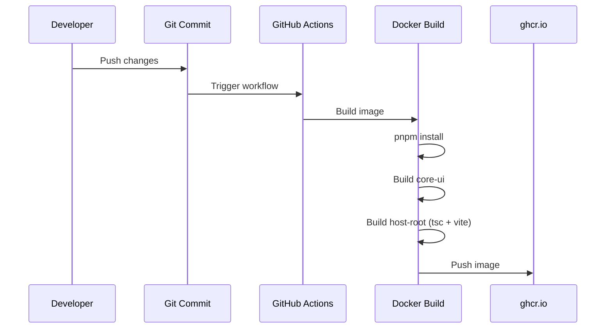

# Implementation Guide

## Development Setup

**Prerequisites:**

- Node.js 24.x
- pnpm package manager
- Docker Desktop (optional, for local Docker testing)
- Git

**Environment:**

- Working directory: Project root `page-builder-cms/`
- All commands run from appropriate package directories

## Code Structure

**Files to Modify:**

```
packages/
  core/
    ui/
      tsup.config.ts          ← Primary fix location
      package.json
      dist/                   ← Generated after build
  host-root/
    Dockerfile                ← Verify build process
    package.json
    vite.config.ts
  render-root/
    Dockerfile                ← Verify build process
    package.json
    vite.config.ts
```

## Implementation Steps

### Step 1: Remove Unused Alias from tsup.config.ts

**File**: `packages/core/ui/tsup.config.ts`

**Current code:**

```typescript
export default defineConfig({
    entry: ["src/index.ts"],
    format: ["esm"],
    dts: true,
    clean: true,
    sourcemap: true,
    external: ["react", "react-dom"],
    treeshake: true,
    esbuildOptions(options) {
        options.banner = {
            js: '"use client"'
        };
        options.alias = {
            "@": "./src" // ← This is unused and should be removed
        };
    }
});
```

**Updated code:**

```typescript
export default defineConfig({
    entry: ["src/index.ts"],
    format: ["esm"],
    dts: true,
    clean: true,
    sourcemap: true,
    external: ["react", "react-dom"],
    treeshake: true,
    esbuildOptions(options) {
        options.banner = {
            js: '"use client"'
        };
        // Removed unused alias - code now uses relative imports
    }
});
```

**Rationale:**

- After refactoring core-ui to use relative imports (e.g., `import { cn } from "../lib/utils"`), the `@` alias is no longer used
- Keeping unused configuration can cause confusion in build tools
- The tsup bundler already correctly handles relative imports

### Step 2: Verify Local Builds

**Build core-ui:**

```bash
cd packages/core/ui
pnpm run build
```

**Expected output:**

- ✅ No errors
- ✅ `dist/index.js` and `dist/index.d.ts` created
- ✅ No warnings about module resolution

**Build host-root:**

```bash
cd packages/host-root
pnpm run build
```

**Expected output:**

```
> @page-builder/host-root@1.0.0 build
> tsc && vite build

vite v6.4.1 building for production...
✓ [number] modules transformed.
dist/index.html     [size] kB
dist/assets/...     [size] kB
✓ built in [time]s
```

### Step 3: Test Development Mode

**Start dev server:**

```bash
cd packages/host-root
pnpm run dev
```

**Verify:**

- ✅ Server starts without errors
- ✅ HMR works when editing core-ui components
- ✅ Source files are resolved via development aliases
- ✅ No console errors related to module resolution

**Test HMR:**

1. Edit a file in `packages/core/ui/src/common/Button.tsx`
2. Check browser console for HMR update logs
3. Verify changes appear without full reload

### Step 4: Test Docker Build (If Docker is Available)

**For host-root:**

```bash
docker build -f packages/host-root/Dockerfile .
```

**Expected:**

- ✅ All stages complete successfully
- ✅ No exit code 2 errors
- ✅ Final nginx image is created

**For render-root:**

```bash
docker build -f packages/render-root/Dockerfile .
```

**Expected:**

- ✅ Same success criteria as host-root

## Integration Points

### Build Pipeline



### Module Resolution Flow

**Development Mode:**

```
host-root imports @page-builder/core-ui
  → Vite dev alias resolves to packages/core/ui/src/index.ts
  → Direct source file access
  → HMR works on source changes
```

**Production Build:**

```
host-root imports @page-builder/core-ui
  → pnpm workspace: resolves to packages/core/ui
  → package.json "main" points to dist/index.js
  → Pre-built bundle is used
  → TypeScript types from dist/index.d.ts
```

## Error Handling

### Potential Issues and Solutions

**Issue 1: "Failed to resolve @page-builder/core-ui"**

- **Cause**: Workspace dependency not installed
- **Solution**: Run `pnpm install` from root
- **Prevention**: Always run install after pulling changes

**Issue 2: "Cannot find module '../lib/utils'"**

- **Cause**: tsup not bundling internal modules correctly
- **Solution**: Verify tsup.config.ts has correct entry point
- **Check**: Ensure `dist/index.js` contains bundled code, not re-exports

**Issue 3: Docker build fails with exit code 2**

- **Cause**: TypeScript compilation error or Vite build error
- **Debug**: Add `--verbose` flag to see detailed errors
- **Solution**: Check CI logs for exact error message

**Issue 4: HMR broken in development**

- **Cause**: Vite aliases misconfigured
- **Solution**: Verify vite.config.ts has development aliases
- **Check**: Console should show `/@fs/` paths in HMR logs

## Performance Considerations

### Build Time Optimization

**Docker Layer Caching:**

- Dependencies copied and installed before source code
- Changes to source don't invalidate dependency layers
- Typical build time: 3-5 minutes in CI

**Local Development:**

- tsup watch mode for instant rebuilds of core packages
- Vite HMR for instant updates in consumer apps
- No manual rebuild needed during development

### Bundle Size

**Before optimization:**

- tsup bundles with sourcemaps enabled
- All internal modules included in bundle
- Tree-shaking removes unused exports

**Monitoring:**

```bash
# Check bundle size
ls -lh packages/core/ui/dist/index.js
# Expected: ~15-20KB for core-ui
```

## Security Notes

### Build-time Security

**No secrets in build:**

- No API keys or credentials in tsup.config.ts
- No sensitive data in source files
- Environment variables handled at runtime, not build time

**Container Security:**

- Using official node:24-alpine base image
- Multi-stage build separates build deps from runtime
- Final nginx image minimal and security-scanned

## Testing Checklist

Before considering implementation complete:

- [ ] tsup.config.ts modified (removed unused alias)
- [ ] core-ui builds successfully
- [ ] host-root builds successfully
- [ ] Development mode works (server starts)
- [ ] HMR works (can edit and see changes)
- [ ] Docker build succeeds (if Docker available)
- [ ] No TypeScript errors
- [ ] No runtime errors in browser console
- [ ] CI/CD pipeline passes (after push)

## Rollback Procedure

If the fix causes issues:

1. **Immediate rollback:**

    ```bash
    git revert HEAD
    git push
    ```

2. **Investigate further:**
    - Check actual CI logs for specific error
    - Test with different Node versions
    - Verify pnpm version consistency

3. **Alternative approach:**
    - Keep alias but don't use it
    - Add explicit TypeScript project references
    - Modify Dockerfile build strategy

## Notes from Implementation

_This section will be updated as implementation progresses with any unexpected findings or adjustments made._

---

**Implementation Status:** Ready to proceed with Step 1
**Next Action:** Modify tsup.config.ts and test builds
