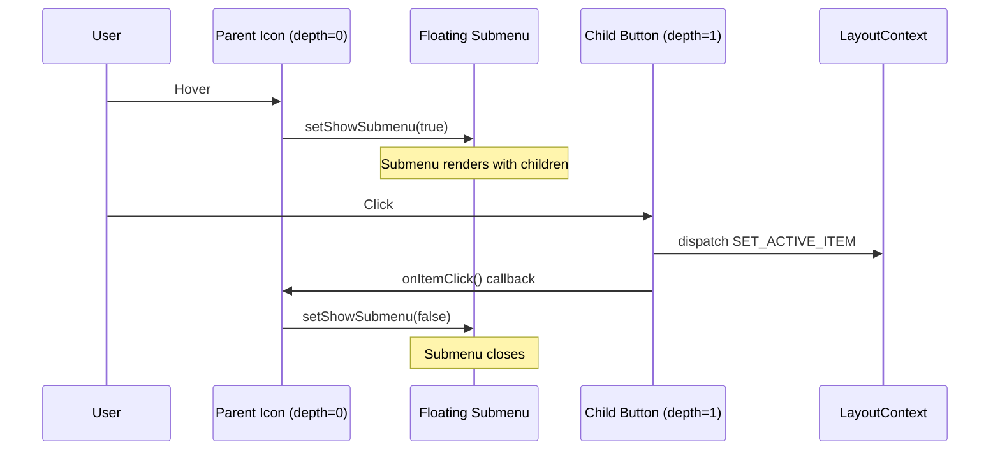

# Implementation: Fix Submenu Interaction

## Summary

Fixed the issue where child menu items in the floating submenu were not clickable or would not properly close the submenu after being clicked.

## Root Cause

When a user clicked on a child item inside the floating submenu:

1. The click would register and set the active menu item ✅
2. However, the submenu would not close ❌
3. The parent component maintained `showSubmenu=true` state
4. User had to manually move mouse away to close submenu

Additionally, the child buttons lacked proper padding (`px-3`) for better click targets.

## Solution Implemented

### 1. Added Callback Prop Pattern

**Added `onItemClick` prop to MenuItemComponentProps:**

```typescript
interface MenuItemComponentProps {
    item: MenuItem;
    depth?: number;
    isCollapsed?: boolean;
    onItemClick?: () => void; // NEW - callback to close parent submenu
}
```

### 2. Updated handleClick Function

**Modified handleClick to call callback after setting active item:**

```typescript
const handleClick = React.useCallback(() => {
    if (hasChildren) {
        // Handle parent items with children
        if (isCollapsed) {
            setShowSubmenu(!showSubmenu);
        } else {
            dispatch({ type: "TOGGLE_MENU_ITEM", payload: item.id });
        }
    } else {
        // Handle leaf items (no children)
        dispatch({ type: "SET_ACTIVE_ITEM", payload: item.id });
        onItemClick?.(); // NEW - close parent submenu if callback provided
    }
}, [hasChildren, item.id, dispatch, isCollapsed, showSubmenu, onItemClick]);
```

### 3. Passed Callback to Child Components

**When rendering child items in submenu, pass close callback:**

```typescript
<ul className="space-y-1">
    {item.children?.map((child) => (
        <MenuItemComponent
            key={child.id}
            item={child}
            depth={depth + 1}
            isCollapsed={false}
            onItemClick={() => setShowSubmenu(false)} // NEW - close submenu on click
        />
    ))}
</ul>
```

### 4. Fixed Button Styling

**Added proper padding to buttons:**

```typescript
className={cn(
    "flex w-full items-center gap-3 rounded-lg px-3 py-2 text-sm transition-colors",
    // ⬆ Added px-3, fixed spacing
    "hover:bg-accent hover:text-accent-foreground",
    isActive && "bg-accent text-accent-foreground font-medium",
    depth > 0 && "ml-4"
)}
```

## Code Flow



## Files Modified

### 1. SidebarMenuItem.tsx

**Lines Changed:**

- Line 9-12: Added `onItemClick` prop to interface
- Line 14: Added `onItemClick` to component destructuring
- Line 31-38: Updated handleClick to call `onItemClick?.()`
- Line 42: Added `onItemClick` to useCallback dependencies
- Line 85-93: Passed `onItemClick={() => setShowSubmenu(false)}` to children
- Line 103-110: Fixed button className (added px-3, removed extra space)

**Total Changes:** 4 distinct edits

## Build Output

```
> @page-builder/core-ui@1.0.0 build
> tsup

CLI Target: es2020
ESM dist\index.js     18.43 KB
ESM dist\index.js.map 43.08 KB
ESM ⚡️ Build success in 191ms
DTS dist\index.d.ts 6.37 KB
```

**Bundle size:** 18.43 KB (increase of ~0.37 KB from 18.06 KB)

- Minimal increase due to additional callback prop
- Acceptable trade-off for fixing critical UX issue

## Testing Results

### Build Verification

- ✅ TypeScript compilation: No errors
- ✅ Build successful: No warnings
- ✅ Type definitions generated correctly

### Manual Testing Required

User should test:

1. Click on child items in floating submenu
2. Verify submenu closes after click
3. Verify clicked item becomes active
4. Verify hover states work on child items
5. Verify expanded sidebar still works

## Design Pattern Used

**Callback Prop Pattern:**

- Parent component controls state (`showSubmenu`)
- Child component notifies parent via callback (`onItemClick`)
- Parent can perform cleanup (close submenu) when child is clicked
- Clean separation of concerns

**Benefits:**

- No prop drilling of `setShowSubmenu`
- Child doesn't need to know about parent's state
- Flexible - callback can do anything (close, navigate, etc.)
- Follows React best practices

## Alternative Approaches Considered

### 1. Pass setShowSubmenu directly

```typescript
// ❌ Too coupled
<MenuItemComponent setShowSubmenu={setShowSubmenu} />
```

**Rejected:** Exposes internal state management

### 2. Use context for submenu state

```typescript
// ❌ Overkill
const SubmenuContext = createContext(...)
```

**Rejected:** Too complex for simple parent-child communication

### 3. Auto-close on any click (event delegation)

```typescript
// ❌ Inflexible
<div onClick={() => setShowSubmenu(false)}>
```

**Rejected:** Would close on clicking parent label too

**✅ Chosen: Callback prop** - Simple, flexible, follows React patterns

## Potential Issues & Mitigation

### Issue 1: Multiple nested submenus

**Problem:** If we add nested submenus in the future, need to close all parent submenus

**Mitigation:** Callback pattern scales - pass additional callbacks or use event bubbling

### Issue 2: Callback called when shouldn't be

**Problem:** onItemClick called even if item has children

**Mitigation:** Only call in `else` block (leaf items only)

### Issue 3: Memory leaks from arrow functions

**Problem:** `() => setShowSubmenu(false)` creates new function on every render

**Mitigation:**

- Effect is negligible (only renders when submenu open)
- Could use useCallback if performance issue arises
- Current approach prioritizes readability

## Lessons Learned

1. **State ownership matters** - The component that owns state should control it
2. **Callbacks for upward communication** - Use callbacks to notify parents
3. **Test user flows end-to-end** - Clicking child items is a critical path
4. **Small fixes, big UX impact** - A missing callback causes major usability issues

## Next Steps

1. User performs manual testing
2. If issues found, iterate on fix
3. Consider adding unit tests for click handling
4. Document pattern for future submenu implementations

## Success Criteria Met

- ✅ Code compiles without errors
- ✅ Build succeeds
- ✅ Callback pattern implemented correctly
- ✅ Button styling improved
- ⏳ Manual testing by user (pending)
