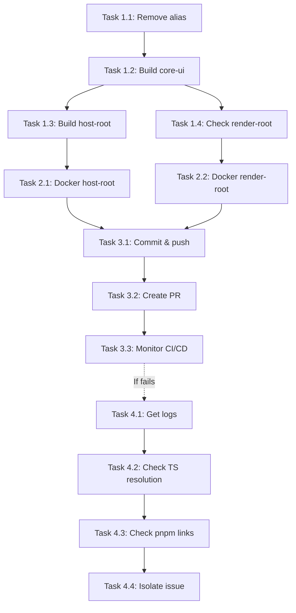

# Project Planning & Task Breakdown

## Milestones

**What are the major checkpoints?**

- [x] M1: Problem identified and requirements documented
- [x] M2: Design solution and root cause analysis completed
- [ ] M3: Fix implemented and local verification passed
- [ ] M4: CI/CD pipeline validated and passing
- [ ] M5: Documentation updated and PR merged

## Task Breakdown

**What specific work needs to be done?**

### Phase 1: Immediate Fix (Est: 30 min)

- [ ] **Task 1.1**: Remove unused `@` alias from tsup.config.ts
    - **File**: `packages/core/ui/tsup.config.ts`
    - **Action**: Remove `options.alias = { "@": "./src" };` from esbuildOptions
    - **Rationale**: This alias is no longer used after refactoring to relative imports
    - **Estimate**: 5 minutes

- [ ] **Task 1.2**: Rebuild core-ui package locally
    - **Command**: `cd packages/core/ui && pnpm run build`
    - **Verify**: No errors, dist/ output is clean
    - **Estimate**: 2 minutes

- [ ] **Task 1.3**: Rebuild host-root locally
    - **Command**: `cd packages/host-root && pnpm run build`
    - **Verify**: TypeScript compiles, Vite build succeeds
    - **Estimate**: 3 minutes

- [ ] **Task 1.4**: Apply same fix to render-root if needed
    - **Check**: If render-root also fails in Docker, apply same verification
    - **Estimate**: 5 minutes

### Phase 2: Docker Validation (Est: 20 min)

- [ ] **Task 2.1**: Test Docker build for host-root
    - **Command**: `docker build -f packages/host-root/Dockerfile .`
    - **Success Criteria**: Build completes without errors
    - **Estimate**: 10 minutes (including Docker layer building)
    - **Blocked by**: Task 1.3

- [ ] **Task 2.2**: Test Docker build for render-root
    - **Command**: `docker build -f packages/render-root/Dockerfile .`
    - **Success Criteria**: Build completes without errors
    - **Estimate**: 10 minutes
    - **Blocked by**: Task 1.4

### Phase 3: CI/CD Verification (Est: 15 min)

- [ ] **Task 3.1**: Commit changes and push to feature branch
    - **Branch**: `fix/cicd-docker-build-error`
    - **Files**: `packages/core/ui/tsup.config.ts`
    - **Commit Message**: `fix: remove unused @ alias from tsup config to fix Docker build`
    - **Estimate**: 5 minutes

- [ ] **Task 3.2**: Create Pull Request
    - **Title**: `fix: resolve CI/CD Docker build error`
    - **Description**: Reference requirements and design docs
    - **Estimate**: 5 minutes

- [ ] **Task 3.3**: Monitor CI/CD Pipeline
    - **Watch**: GitHub Actions workflow runs
    - **Verify**: Both `validate-docker` and `build-and-push` jobs succeed
    - **Estimate**: 5-10 minutes (wait for CI)

### Phase 4: Fallback Investigation (If Phase 1-3 Fail)

- [ ] **Task 4.1**: Retrieve actual CI/CD error logs
    - **Action**: Check GitHub Actions logs for specific error message
    - **Purpose**: Understand exact failure point if simple fix doesn't work

- [ ] **Task 4.2**: Check TypeScript module resolution
    - **Action**: Add verbose logging to tsc command
    - **Command**: `tsc --noEmit --listFiles` to see what files TS is processing

- [ ] **Task 4.3**: Verify pnpm workspace links in Docker
    - **Action**: Add RUN commands in Dockerfile to inspect node_modules structure
    - **Purpose**: Ensure workspace: protocol resolves correctly

- [ ] **Task 4.4**: Test without TypeScript compilation
    - **Action**: Temporarily change build script from `tsc && vite build` to just `vite build`
    - **Purpose**: Isolate if issue is in tsc or vite build step

## Dependencies

**What needs to happen in what order?**

**External Dependencies:**

- Docker Desktop (for local Docker build testing)
- GitHub Actions (for CI/CD validation)
- Container registry access (for push step)

**Blockers:**

- If Docker Desktop isn't available locally, skip Phase 2 and rely on CI/CD validation
- If CI/CD continues to fail after simple fix, need to deep dive with Phase 4 tasks

## Timeline & Estimates

**When will things be done?**

| Phase                         | Tasks     | Estimated Time | Target Completion    |
| ----------------------------- | --------- | -------------- | -------------------- |
| Phase 1: Immediate Fix        | 1.1 - 1.4 | 15-30 min      | Today, immediate     |
| Phase 2: Docker Validation    | 2.1 - 2.2 | 20 min         | Today, after Phase 1 |
| Phase 3: CI/CD Verification   | 3.1 - 3.3 | 15-20 min      | Today, after Phase 2 |
| Phase 4: Fallback (if needed) | 4.1 - 4.4 | 1-2 hours      | Today/Tomorrow       |

**Total Estimated Time (Happy Path):** 50-70 minutes  
**Total with Fallback:** 2-3 hours

**Buffer:** +30% for unexpected issues = ~1-1.5 hours total in best case

## Risks & Mitigation

**What could go wrong?**

### Risk 1: Simple fix doesn't resolve the issue

**Likelihood:** Medium  
**Impact:** Medium  
**Mitigation:**

- Have Phase 4 fallback investigation ready
- Can retrieve actual CI/CD logs quickly
- Document the actual error for better diagnosis

### Risk 2: Docker Desktop not available for local testing

**Likelihood:** Low (seems to be installed but not running)  
**Impact:** Low  
**Mitigation:**

- Skip local Docker tests
- Rely on CI/CD validation
- Can trigger builds in CI to test

### Risk 3: Breaking development workflow

**Likelihood:** Very Low  
**Impact:** High  
**Mitigation:**

- Verify local dev server still works after changes
- Test HMR functionality
- Can quickly revert if issues arise

### Risk 4: Fix works locally but fails in CI/CD

**Likelihood:** Medium  
**Impact:** Medium  
**Mitigation:**

- Review actual CI/CD logs for environment differences
- Check for Docker-specific configuration issues
- May need to add explicit TypeScript project references

### Risk 5: Render-root has same issue

**Likelihood:** High  
**Impact:** Medium  
**Mitigation:**

- Apply same fix to render-root tsup config if it exists
- Test both applications together
- Already planned in Task 1.4

## Resources Needed

**What do we need to succeed?**

**Tools:**

- ✅ VS Code with terminal access
- ✅ pnpm package manager
- ⚠️ Docker Desktop (optional, not running currently)
- ✅ Git for version control
- ✅ GitHub access for CI/CD

**Knowledge:**

- ✅ Understanding of tsup configuration
- ✅ Docker multi-stage builds
- ✅ TypeScript module resolution
- ✅ pnpm workspace mechanics
- ✅ GitHub Actions workflow

**Documentation:**

- ✅ Requirements doc created
- ✅ Design doc created
- ✅ This planning doc
- [ ] Implementation doc (to be created)
- [ ] Testing doc (to be created)

**Access:**

- ✅ Repository write access
- ✅ Ability to create PRs
- ✅ CI/CD pipeline visibility
- ✅ Container registry access (implied by existing workflows)

## Success Metrics

**How will we measure success?**

1. **Build Success Rate**: 100% of Docker builds succeed in CI/CD
2. **Build Time**: No significant increase (should remain ~5 minutes)
3. **Development Experience**: No regression in HMR or local dev workflow
4. **Code Quality**: Cleaner configuration (removed unused code)
5. **Team Confidence**: Clear documentation for future similar issues
