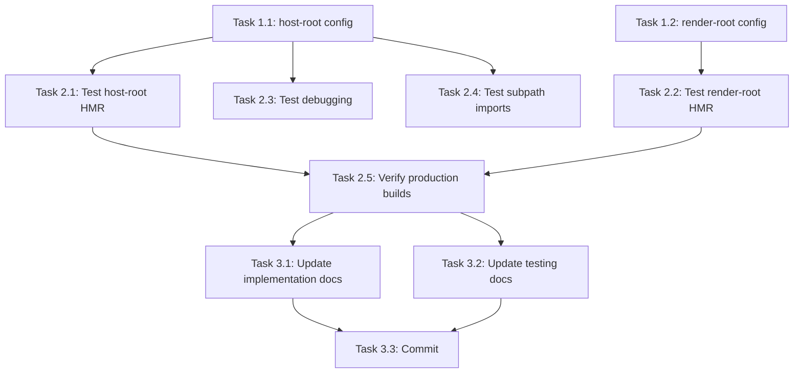

# Project Planning & Task Breakdown

## Milestones

**What are the major checkpoints?**

- [x] M1: Requirements and design documentation complete
- [ ] M2: Configuration implemented and tested in host-root
- [ ] M3: Configuration implemented and tested in render-root
- [ ] M4: Cross-package HMR verified working
- [ ] M5: Production builds verified unaffected

## Task Breakdown

**What specific work needs to be done?**

### Phase 1: Configuration Implementation

**Task 1.1: Update host-root vite.config.ts**

- [ ] Read the current host-root vite.config.ts
- [ ] Define the packagesDir path resolution
- [ ] Create alias array with regex patterns for core-ui and core-utils
- [ ] Integrate aliases into resolve.alias configuration
- [ ] Add conditional logic for dev-mode only
- [ ] Verify existing configurations are preserved
- **Estimate**: 15-20 minutes
- **Files**: `packages/host-root/vite.config.ts`

**Task 1.2: Update render-root vite.config.ts**

- [ ] Read the current render-root vite.config.ts
- [ ] Apply the same alias pattern as host-root
- [ ] Ensure consistency with host-root approach
- [ ] Verify existing configurations are preserved
- **Estimate**: 10-15 minutes
- **Files**: `packages/render-root/vite.config.ts`

### Phase 2: Testing & Verification

**Task 2.1: Test HMR in host-root**

- [ ] Start host-root dev server (`pnpm --filter @page-builder/host-root dev`)
- [ ] Make a visible change to a core-ui component (e.g., Button text color)
- [ ] Verify change appears in browser without manual rebuild
- [ ] Time the HMR cycle (should be < 500ms)
- [ ] Check browser console for any module resolution errors
- **Estimate**: 10 minutes
- **Depends on**: Task 1.1

**Task 2.2: Test HMR in render-root**

- [ ] Start render-root dev server (`pnpm --filter @page-builder/render-root dev`)
- [ ] Make a visible change to a core-ui component
- [ ] Verify change appears in browser without manual rebuild
- [ ] Time the HMR cycle (should be < 500ms)
- [ ] Check browser console for any module resolution errors
- **Estimate**: 10 minutes
- **Depends on**: Task 1.2

**Task 2.3: Test debugging experience**

- [ ] Start host-root in dev mode
- [ ] Open browser DevTools
- [ ] Set breakpoint in a core-utils function called from host-root
- [ ] Verify breakpoint shows TypeScript source code with correct line numbers
- [ ] Test stepping into/through the source code
- **Estimate**: 10 minutes
- **Depends on**: Task 1.1

**Task 2.4: Test subpath imports**

- [ ] Create a test import using a subpath (e.g., `import { Button } from '@page-builder/core-ui/common/Button'`)
- [ ] Verify it resolves correctly to source
- [ ] Verify HMR works for the specific file
- [ ] Remove test import after verification
- **Estimate**: 5 minutes
- **Depends on**: Task 1.1

**Task 2.5: Verify production builds**

- [ ] Run production build for host-root (`pnpm --filter @page-builder/host-root build`)
- [ ] Inspect the built output in `dist/`
- [ ] Verify it uses bundled code from workspace packages (not source references)
- [ ] Run production build for render-root
- [ ] Verify same behavior
- [ ] Test production preview mode works correctly
- **Estimate**: 15 minutes
- **Depends on**: Tasks 1.1, 1.2

### Phase 3: Documentation & Cleanup

**Task 3.1: Update implementation documentation**

- [ ] Document the configuration pattern in `docs/ai/implementation/feature-vite-monorepo-dev-aliases.md`
- [ ] Add code examples showing the final configuration
- [ ] Note any gotchas or edge cases discovered during testing
- [ ] Update with actual measured HMR times
- **Estimate**: 10 minutes
- **Depends on**: Phase 2 completion

**Task 3.2: Update testing documentation**

- [ ] Document test results in `docs/ai/testing/feature-vite-monorepo-dev-aliases.md`
- [ ] Record HMR performance measurements
- [ ] Note any issues found and resolved
- [ ] Mark all test cases as passing
- **Estimate**: 10 minutes
- **Depends on**: Phase 2 completion

**Task 3.3: Create commit and summary**

- [ ] Stage all changed files
- [ ] Create descriptive commit message following conventional commits
- [ ] Optionally create a PR/MR if using Git workflow
- **Estimate**: 5 minutes
- **Depends on**: All previous tasks

## Dependencies

**What needs to happen in what order?**

### Task dependencies:

### External dependencies:

- None - all work is self-contained
- No API changes, no external service dependencies

### Team/resource dependencies:

- Single developer can complete all tasks
- No cross-team coordination needed

## Timeline & Estimates

**When will things be done?**

### Total estimated effort:

- **Phase 1 (Implementation)**: 25-35 minutes
- **Phase 2 (Testing)**: 50 minutes
- **Phase 3 (Documentation)**: 25 minutes
- **Total**: ~1.5-2 hours

### Suggested implementation order:

1. **Session 1** (60 min): Tasks 1.1, 1.2, 2.1, 2.2 - Core implementation and basic testing
2. **Session 2** (30 min): Tasks 2.3, 2.4, 2.5 - Comprehensive verification
3. **Session 3** (20 min): Tasks 3.1, 3.2, 3.3 - Documentation and commit

### Target completion:

- Can be completed in a single 2-hour development session
- Or broken into 3 shorter sessions as shown above

## Risks & Mitigation

**What could go wrong?**

### Risk 1: Windows path resolution issues

**Likelihood**: Low
**Impact**: High (feature wouldn't work)
**Mitigation**:

- Use `path.resolve()` for all path operations (cross-platform)
- Test immediately after implementation
- Have rollback plan (git revert)

### Risk 2: Conflict with existing aliases

**Likelihood**: Low
**Impact**: Medium (some imports might break)
**Mitigation**:

- Carefully preserve existing alias configurations
- Test all existing routes/pages after changes
- Use spread operator to combine old and new aliases

### Risk 3: TanStack Router plugin interference

**Likelihood**: Very Low
**Impact**: Medium (routing might break)
**Mitigation**:

- Review TanStack Router docs for any known alias issues
- Test routing immediately after implementation
- Plugin runs before resolution, should not conflict

### Risk 4: Production build accidentally uses source files

**Likelihood**: Low
**Impact**: High (broken production build)
**Mitigation**:

- Use proper mode conditional (`mode === 'development'`)
- Test production builds thoroughly (Task 2.5)
- Verify dist output doesn't reference source paths

### Risk 5: CSS import resolution breaks

**Likelihood**: Low
**Impact**: Medium (styling breaks)
**Mitigation**:

- Keep CSS imports explicit (don't alias)
- Test that styles load correctly after changes
- Document the CSS import pattern

## Resources Needed

**What do we need to succeed?**

### Team members and roles:

- 1 developer (full-stack, familiar with Vite and monorepo setup)

### Tools and services:

- VS Code (already in use)
- pnpm (already installed)
- Browser DevTools (for HMR/debugging testing)
- Git (for version control)

### Infrastructure:

- Local development environment
- No external services required

### Documentation/knowledge:

- Reference: n8n vite.config.mts (already fetched)
- Vite documentation on resolve.alias
- Current understanding of monorepo structure

### No blockers - ready to proceed with implementation!
